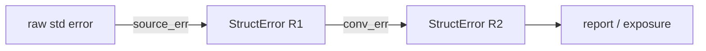
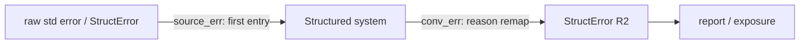

# `orion-error`

> **Structured error governance for layered Rust systems.**

[English](./README.md) · [简体中文](./README.zh-CN.md)

<p align="center">
  <a href="https://crates.io/crates/orion-error"></a>
  <a href="https://crates.io/crates/orion-error"></a>
  <a href="https://docs.rs/orion-error"></a>
  <a href="./LICENSE"></a>
  <a href="https://github.com/galaxio-labs/orion-error/actions"></a>
  <a href="https://coveralls.io/github/galaxio-labs/orion-error?branch=main"></a>
  <a href="https://deps.rs/repo/github/galaxio-labs/orion-error"></a>
  <a href="https://github.com/galaxio-labs/orion-error/releases"></a>
</p>

`orion-error` is not primarily about prettier error text or local error ergonomics.

It is a Rust crate for systems that need failures to stay structured across
layers and boundaries.

## Table of Contents

- [Why It Is Useful](#why-it-is-useful)
- [Install](#install)
- [Quick Start](#quick-start)
- [The 4 APIs To Learn First](#the-4-apis-to-learn-first)
- [Typical Flow](#typical-flow)
- [Service Boundary Helpers](#service-boundary-helpers)
- [Third-Party Error Types](#third-party-error-types)
- [Standard Error Interop](#standard-error-interop)
- [Recommended Imports](#recommended-imports)
- [Import Strategy](#import-strategy)
- [Error Flow Paths](#error-flow-paths)
- [Optional Features](#optional-features)
- [Try It](#try-it)
- [Learn More](#learn-more)

## Why It Is Useful

The design is centered on three parts:

- **contract channel** — stable identity, category, retryability, visibility
- **diagnostic channel** — detail, source chain, operation context, key fields
- **adaptive output** — HTTP / RPC / CLI / log projections generated by policy

In Rust, those ideas land as:

- `#[derive(OrionError)]` for stable semantic identities
- `StructError<R>` as the unified runtime carrier
- `source_err(...)` for first entry and semantic-boundary wrapping
- `conv_err()` for reason remapping without rebuilding the error story
- `report()` / `identity_snapshot()` / `exposure(...)` for boundary output

Use this crate when you want:

- one shared error language across service / repo / adapter / protocol layers
- clear business error enums instead of scattered strings
- one consistent way to attach detail, source, and operation context
- stable machine-facing identity for HTTP / RPC / log / CLI boundaries
- controlled bridging to `std::error::Error` only where needed
- a system that scales better than local `Result<T, String>` habits

If you only need a small local enum inside one module, `thiserror` alone may be
enough. If you mainly want application-level convenience with rich ad hoc
context, `anyhow` may also be enough. `orion-error` is aimed at systems with
layers, semantic boundaries, and stable boundary-facing error behavior.

In short:

| Crate          | Best fit                                                        |
| -------------- | --------------------------------------------------------------- |
| `thiserror`    | Local error modeling inside a single module or crate            |
| `anyhow`       | Application-level convenience with ad hoc context               |
| `orion-error`  | Project-wide structured error governance across layers          |

## Install

```toml
[dependencies]
orion-error = "0.8"
```

Default features include `derive` and `log` — add a feature only when you need it.

## Quick Start

```rust
use derive_more::From;
use orion_error::{
    prelude::*,
    runtime::OperationContext,
};

#[derive(Debug, Clone, PartialEq, From, OrionError)]
enum AppReason {
    #[orion_error(identity = "biz.invalid_request")]
    InvalidRequest,
    #[orion_error(transparent)]
    General(UnifiedReason),
}

fn load_config(path: &str) -> Result<String, StructError<AppReason>> {
    let ctx = OperationContext::doing("load_config")
        .with_field("path", path);

    std::fs::read_to_string(path)
        .source_err(AppReason::system_error(), "read config failed")
        .doing("read file")
        .with_context(&ctx)
}
```

What happens here:

- `AppReason` is your domain reason enum
- `StructError<AppReason>` is the runtime error carrier
- `source_err(...)` converts a normal Rust error into the structured system
- `doing(...)` and `with_context(...)` add operation context

For new code, treat `doing(...)` as the standard operation verb.

## The 4 APIs To Learn First

| # | API | When to use |
| - | --- | ----------- |
| 1 | `#[derive(OrionError)]` | Define stable business-facing reason enums |
| 2 | `source_err(reason, detail)` | An error enters the structured system — for both raw `std::error::Error` and already-structured `StructError<_>` sources |
| 3 | `conv_err()` | Upstream value is already `StructError<R1>`; you only remap reason type to `StructError<R2>` |
| 4 | `exposure(&policy)` | At service boundaries, project the error into HTTP/RPC/CLI/log output |

## Typical Flow



This is the important shift:

- lower layers do not invent random output shapes
- middle layers do not lose source and context
- boundary layers do not re-interpret raw strings
- the whole system shares one governance model

## Service Boundary Helpers

When you reach HTTP/RPC/log/CLI boundaries, these are the main entry points:

- `report()` for human-oriented diagnostics
- `identity_snapshot()` for stable identity inspection
- `exposure(...)` with `to_http_error_json()`, `to_cli_error_json()`, `to_log_error_json()`, `to_rpc_error_json()`

Current protocol naming is `Exposure*`, not `ErrorPolicy*`.

That matters because large systems usually fail at the boundary:

- one team exposes too much detail
- another team hides everything
- every protocol builds its own error schema

`orion-error` gives those boundaries one consistent projection model.

## Third-Party Error Types

`source_err` supports built-in types (`io::Error`, `serde_json::Error`, `anyhow::Error`,
`toml::Error`) and custom types via opt-in:

```rust
use orion_error::interop::{raw_source, RawStdError};
use orion_error::prelude::*;

#[derive(Debug)]
struct MyError;

impl std::fmt::Display for MyError {
    fn fmt(&self, f: &mut std::fmt::Formatter<'_>) -> std::fmt::Result {
        write!(f, "my custom error")
    }
}

impl std::error::Error for MyError {}

// Step 1: declare it as a raw source
impl RawStdError for MyError {}

// Step 2: wrap + convert
let result: Result<(), MyError> = Err(MyError);
let err = result
    .map_err(raw_source)
    .source_err(UnifiedReason::system_error(), "my operation failed")
    .unwrap_err();

assert_eq!(err.source_ref().unwrap().to_string(), "my custom error");
```

> **Why opt-in instead of blanket `E: StdError`?** A blanket impl would silently
> swallow `StructError<_>` values as unstructured sources, losing their structured
> identity and context. The opt-in ensures you explicitly choose which types enter
> as unstructured sources versus structured ones.

**Newtype wrapper for foreign types.** If the error type comes from a dependency
and you cannot implement `RawStdError` directly (orphan rule), use a newtype:

```rust
use orion_error::interop::{raw_source, RawStdError};
use orion_error::prelude::*;

#[derive(Debug)]
struct ForeignError;

impl std::fmt::Display for ForeignError {
    fn fmt(&self, f: &mut std::fmt::Formatter<'_>) -> std::fmt::Result {
        write!(f, "foreign failure")
    }
}
impl std::error::Error for ForeignError {}

#[derive(Debug)]
struct WrappedError(ForeignError);

impl std::fmt::Display for WrappedError {
    fn fmt(&self, f: &mut std::fmt::Formatter<'_>) -> std::fmt::Result {
        std::fmt::Display::fmt(&self.0, f)
    }
}
impl std::error::Error for WrappedError {}
impl RawStdError for WrappedError {}

// Usage
let result: Result<(), WrappedError> = Err(WrappedError(ForeignError));
let err = result
    .map_err(raw_source)
    .source_err(UnifiedReason::system_error(), "api call failed")
    .unwrap_err();

assert_eq!(err.source_ref().unwrap().to_string(), "foreign failure");
```

## Standard Error Interop

`StructError<R>` no longer directly implements `std::error::Error`.

Use the explicit interop APIs when you need that ecosystem:

```rust
use orion_error::{StructError, UnifiedReason};

let borrowed_err = StructError::from(UnifiedReason::system_error());
let owned_err = StructError::from(UnifiedReason::system_error());
let boxed_err = StructError::from(UnifiedReason::system_error());

let borrowed_std = borrowed_err.as_std();
let owned_std = owned_err.into_std();
let boxed_std = boxed_err.into_boxed_std();

assert!(std::error::Error::source(&borrowed_std).is_none());
assert!(std::error::Error::source(&owned_std).is_none());
assert!(std::error::Error::source(boxed_std.as_ref()).is_none());
```

## Recommended Imports

For new code, start with:

```rust
use orion_error::prelude::*;
```

Treat this as the default for business code. Only switch to layered imports when
the module is explicitly modeling architecture boundaries, protocol adapters,
or test/schema checks.

Then add only the layered imports you need, for example:

- `orion_error::runtime::OperationContext`
- `orion_error::runtime::source::*`
- `orion_error::report::*`
- `orion_error::protocol::*`

This keeps normal application code on one predictable entry path while still
letting larger codebases keep clear module boundaries where that extra
precision is useful.

## Import Strategy

Three tiers:

**Application code (default)**
```rust
use orion_error::prelude::*;
use orion_error::runtime::OperationContext;
```

**Architecture boundaries** — use layered imports to make module coupling explicit.
```rust
// Domain layer
use orion_error::prelude::*;
use orion_error::reason::{ErrorCategory, ErrorIdentityProvider};

// Service / adapter layer — struct error is your carrier
use orion_error::{prelude::*, conversion::*};

// Protocol / boundary layer — output projection only
use orion_error::protocol::*;
use orion_error::report::{DiagnosticReport, RedactPolicy};

// Interop — when you must enter std::error::Error ecosystem
use orion_error::interop::*;
```

**Test / migration**
```rust
use orion_error::dev::prelude::*;
use orion_error::dev::testing::*;
```

## Error Flow Paths

There are exactly four ways a `StructError` enters or moves through your system:



**1. `source_err(reason, detail)`** — unified entry point. Works for both raw
   `std::error::Error` and already-structured `StructError` sources. Use this
   whenever an error enters your system.

**2. `conv_err()`** — cross-layer conversion preserving semantics. The upstream error is
   already `StructError<R1>`; you only want to map the reason type to `StructError<R2>` via
   `From`. All detail, context, source, and metadata survive.

**3. `as_std() / into_std() / into_dyn_std()`** — exit point. Bridges the structured error
   into the `std::error::Error` ecosystem for interop or legacy interfaces. These are
   explicit; `StructError<T>` does not implement `StdError` directly.

## Optional Features

Add features only when your project needs them:

| Feature | Purpose |
| ------- | ------- |
| `serde` | Serialize / Deserialize |
| `serde_json` | Protocol JSON projections |
| `tracing` | Tracing integration |
| `anyhow` | `anyhow::Error` interop |
| `toml` | `toml::Error` interop |

```toml
[dependencies]
orion-error = { version = "0.8", features = ["serde"] }       # Serialize/Deserialize
orion-error = { version = "0.8", features = ["serde_json"] }  # Protocol JSON projections
orion-error = { version = "0.8", features = ["tracing"] }     # Tracing integration
orion-error = { version = "0.8", features = ["anyhow"] }      # anyhow::Error interop
orion-error = { version = "0.8", features = ["toml"] }        # toml::Error interop
```

`serde`, `serde_json`, `tracing`, `anyhow`, `toml` are optional. The default (`derive` + `log`) covers the core path.

## Try It

```bash
cargo test --all-features -- --test-threads=1
cargo run --example order_case
cargo run --example logging_example --features log
```

## Learn More

- [中文 README](./README.zh-CN.md)
- [Changelog](./CHANGELOG.md)
- [English docs](./docs/en/src/README.md)
- [中文文档](./docs/zh/src/README.md)
- [Tutorial](./docs/en/src/user/tutorial.md)
- [Protocol Contract](./docs/en/src/user/protocol-contract.md)
- [thiserror Comparison](./docs/en/src/user/thiserror-comparison.md)
- [orion-error-derive README](./orion-error-derive/README.md)

## License

Licensed under the [MIT License](./LICENSE).

## Maintainers

If publishing this crate family:

1. publish `orion-error-derive`
2. wait for crates.io index propagation
3. publish `orion-error`
