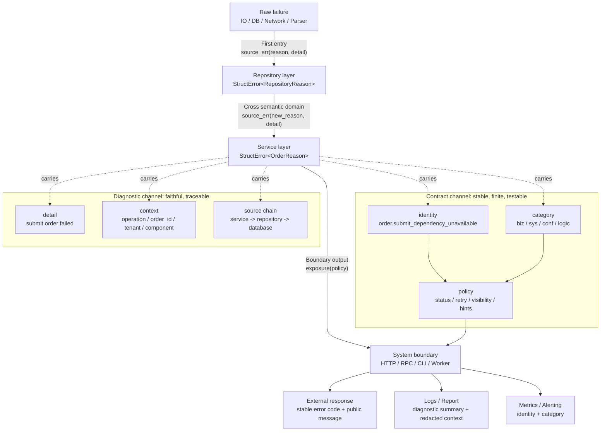
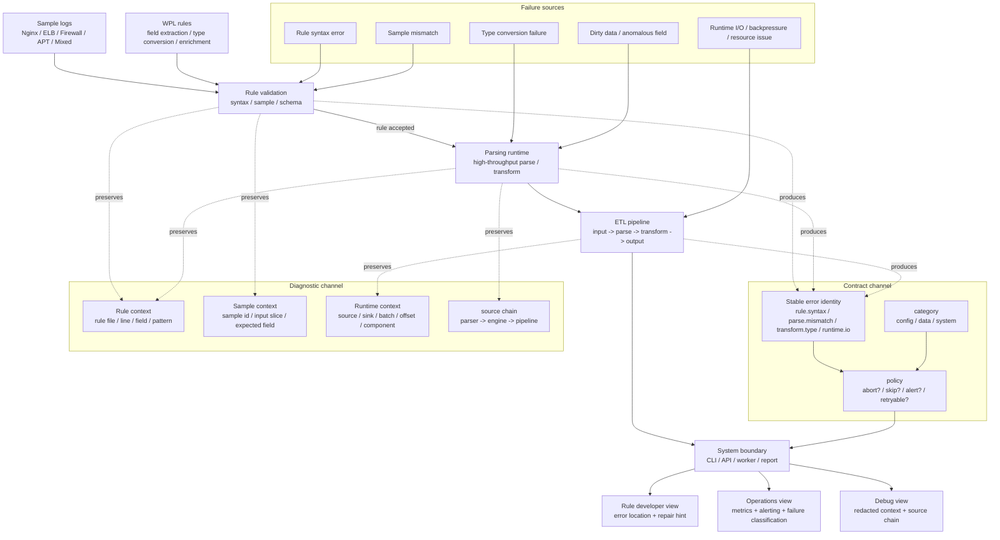

# The Wukong Error Governance Model: Stable Contracts, Reliable Diagnostics, and Adaptive Output

This article discusses one question: how an industrial-grade system can bring highly variable failures into a structure that is governable, diagnosable, and evolvable.

If you only want the main thread, start with these four sections:

1. [Core Tension](#core-tension): why error governance is fundamentally about convergence vs. diagnostics.
2. [Our Approach: The Wukong Error Governance Model](#our-approach-the-wukong-error-governance-model): how the model governs errors through stable contracts, reliable diagnostics, and adaptive output.
3. [Error Governance in Rust](#error-governance-in-rust): how to implement the model with `orion-error`.
4. [Industrial Validation: WarpParse](#industrial-validation-warpparse): how a high-throughput ETL system validates the approach.

This article has three layers. Read as needed:

- **Methodology** ([Error Handling Is the Boundary Between Prototypes and Industrial Systems](#error-handling-is-the-boundary-between-prototypes-and-industrial-systems) -> [Governance Levels](#governance-levels)): the core tension, the Wukong model, five principles, three propagation modes, and maturity levels.
- **Engineering implementation** ([Error Governance in Rust](#error-governance-in-rust)): how `orion-error` turns the methodology into Rust code, including design rules and testing guidance.
- **Industrial validation** ([Industrial Validation: WarpParse](#industrial-validation-warpparse) -> [Engineering Reuse for AI](#engineering-reuse-for-ai)): validation in a high-throughput ETL setting, plus how to distill the approach into reusable engineering skills for AI.
- **Appendix** ([Appendix: Language Mechanisms and Ecosystem Adoption](#appendix-language-mechanisms-and-ecosystem-adoption)): implementation tradeoffs in Java, TypeScript, Go, C++, Swift, and C#. You can skip it without losing the main argument.

---

## Error Handling Is the Boundary Between Prototypes and Industrial Systems

A prototype only needs to prove that the happy path works. An industrial system must remain operable, diagnosable, recoverable, and evolvable under non-ideal conditions.

Systems do not live in ideal conditions for long. Inputs change. Dependencies degrade. Networks jitter. Configurations drift. Data accumulates dirty state. Business rules evolve. Execution paths branch dynamically based on users, environment, state, and policy. The happy path is not the whole system. Failure, degradation, retry, rollback, compensation, and manual intervention are also part of the lifecycle.

So an error is not just "an unexpected string outside normal logic". It is information the system must carry when it continues operating under imperfect conditions, restores state, decides external responses, and supports diagnosis.

Many projects treat error handling early on as "each function's own business". Each function decides how to express failure, and that decision gets remade in the next function, the next module, and the next boundary.

That can work in small systems: short call chains, few boundaries, shared memory of context among participants. But once errors start crossing team boundaries, subsystem boundaries, service boundaries, protocol boundaries, or long-term compatibility boundaries without a unified shape, the failure path becomes ungovernable:

- The same failure becomes a string in module A, an enum in module B, and a panic in module C.
- Each layer rebuilds JSON at the boundary, but the structure is inconsistent.
- Troubleshooting finds scattered messages in logs, but no complete error path.
- Refactoring avoids touching error types because no one knows which upper layers depend on string content.

These problems do not always come from a single function being "badly written". They can also come from missing tools, weak team conventions, historical drift, turnover, or unclear boundary ownership. The key point is this: once an error must travel across boundaries, be consumed by multiple roles, and remain compatible over time, it is no longer just local control flow.

Error governance defines how a system preserves information after failure, carries it across layers, exposes it externally, supports diagnosis, and evolves it over time. It is not decoration around business logic. It is the information architecture for when business logic fails.

---

## The Industry Has Been Exploring Error Handling for a Long Time

Professional engineers and industry practice already agree that error handling matters. The hard part is not whether to handle errors, but how: without letting errors swallow business code, without letting failures collapse into ungovernable strings, while still giving callers stable decisions and giving troubleshooters enough detail.

Different language designs show that this problem has never had a single answer.

- C relies mainly on return codes, `errno`, and conventions. Direct and cheap, but error information fragments easily and callers often miss checks.
- Java makes exceptions the primary path and distinguishes checked from unchecked exceptions. It strengthens propagation, but also brings exploding exception hierarchies, blurry boundary semantics, and over-catching.
- Go emphasizes explicit `error` returns, making failure visible in the call path. But without team discipline, errors easily become layer after layer of wrapped strings.
- Rust uses `Result<T, E>`, `?`, enums, and the type system to make errors part of ordinary control flow. But classification, context, boundary exposure, and diagnostic policy still require engineering design.

Each design makes tradeoffs. Language mechanisms can lower the cost of error handling, but they do not replace error governance itself. In large systems, the real problem is not choosing exceptions, return codes, or `Result`. It is deciding how failure information is classified, preserved, transformed, exposed, and observed across the system.

For engineering teams, error handling spans type design, call-chain propagation, logging and observability, protocol output, user experience, operational policy, and long-term compatibility. If each part is handled independently, the cost eventually surfaces in troubleshooting, refactoring, and cross-boundary collaboration.

So error handling cannot rely only on personal experience or local habits. It needs a methodology that can be discussed, executed, and evolved.

To this day, the industry still has no unified cross-language, cross-framework, cross-domain model for error governance. But strong projects have converged on useful practices in different directions:

- Stable error codes
- Structured diagnostics
- Centralized boundary policy
- State-oriented error presentation
- Observable failure signals
- User-facing repair hints

These practices show that error governance is not one API problem. It is a set of engineering constraints built around failure information.

## Evidence from Strong Projects

| Project | Practice | Lesson |
|---------|----------|--------|
| gRPC | Cross-language RPC failures converge to standard status codes | Stable classification lets callers retry, degrade, alert, and map user responses |
| PostgreSQL | Stable SQLSTATE codes instead of depending on message text | Machine contracts and human prose should be separate |
| Kubernetes | Readiness, failure reason, and conditions are written into `status` | Errors can become queryable, automatable system state |
| Terraform | Diagnostics carry severity, summary, detail, and attribute path | Errors should identify location, cause, and repair direction |
| rustc | Error codes, source location, labels, notes, and help shape the diagnostic experience | Diagnostics themselves are part of product quality |
| Envoy | Access log response flags express stable failure reasons | Boundary-layer errors should be searchable, aggregatable, alertable, and analyzable |

These projects differ in form, but point in the same direction: strong error handling designs the failure path as a stable information system. Machines can classify it, humans can diagnose it, internal detail is preserved, external exposure is policy-driven, and the same error serves both the current request and later troubleshooting, monitoring, and evolution.

---

## Core Tension

Any error governance model must resolve one fundamental tension:

**Convergence vs. diagnostics**

- Callers need **stable, finite classifications**, otherwise they cannot make governance decisions such as retry, degrade, alert, or return a user response.
- Troubleshooters need **complete, detail-preserving information**, otherwise they cannot identify root cause.

Both demands are valid, but they naturally pull in different directions.

If errors expose too much technical detail to callers, upper layers start depending on the exact failure shapes of databases, network libraries, filesystems, and third-party SDKs. System boundaries are pierced by implementation detail. Refactoring the lower layer then forces contract changes.

If errors preserve only upper-layer business classifications, troubleshooting loses the critical path: what the original failure was, which component it occurred in, which layers it passed through, what each layer added, and why it was finally mapped to the external response.

So the central problem is not "whether to wrap errors". It is this: **how to make errors converge for governance while remaining faithful for diagnostics.**

### Inadequate Solutions

| Strategy | For callers | For troubleshooters |
|----------|-------------|---------------------|
| Throw only technical exceptions | Not governable | Full information |
| Throw only business errors | Governable | Root cause lost |
| Pure string chaining | Not governable | Human-readable, but not structurally queryable |
| Typed wrapping with preserved cause | Some local governance | Cause chain preserved, but classification and boundary policy still need extra rules |
| Swallow the error | Clean surface | All information lost |

Pure string chains only concatenate prose. Typed wrapping with preserved cause information (`cause` chains, typed wrapping, `errors.Is`/`errors.As`) supports some structured querying, but it solves only one part of the problem: how causes are preserved and queried. It does not automatically solve stable error identity, classification boundaries, exposure policy, or mappings to governance actions.

When one single representation is forced to satisfy both governance and diagnostics, one side usually loses: either callers get information too scattered for automation, or troubleshooters get too little information and must grep logs and reproduce failures manually.

### Our Approach: The Wukong Error Governance Model

This article calls the methodology the **Wukong Error Governance Model**. What it "subdues" is not mythological demons, but the wildly varying failures inside industrial systems: using stable contracts to make errors legible, reliable diagnostics to preserve root causes and context, adaptive output to provide the right stable view for each audience, and production observation to keep the model evolving.

The name comes from the image of Wukong defeating monsters on the journey west. In software engineering, what we want to subdue and contain is not literal monsters, but errors themselves: giving them names, classes, traceability, and control, instead of letting them spread as scattered strings, implicit wrapping, and boundary leakage.

The core method is simple: **separate stable contracts and reliable diagnostics into two channels, then generate adaptive output per audience.**

```text
Internal error model = contract channel + diagnostic channel
Adaptive output = audience-specific projections generated from the internal model under policy
```

The contract channel contains stable error identity, stable classification, and policy semantics. It serves governance decisions such as retry, degrade, alert, HTTP/RPC/CLI mapping, user hints, and SLA accounting. It should be finite, stable, documentable, and testable.

The diagnostic channel contains the diagnostic chain, context, and detail. It serves root-cause analysis: lower-level causes, traversed layers, the current operation, important fields, component, and environment. It can be richer and more dynamic, but it should not become the stable contract exposed to external callers.

The contract and diagnostic channels describe the information structure carried by errors internally. HTTP responses, RPC errors, CLI output, log records, metric labels, and debug reports are adaptive output views generated at different boundaries. Output views should not leak back and distort the internal error model.

| Channel | Contains | Serves | Stability requirement |
|---------|----------|--------|-----------------------|
| Contract channel | Stable error identity, stable classification, category, retryable, exposure level | Callers, gateways, monitoring, operations policy, protocol clients | High; should be documented and enforced by tests |
| Diagnostic channel | Cause chain, operation context, key fields, dynamic detail, lower-level errors | Developers, SREs, troubleshooting tools, logging systems | May change, but must remain detailed, reliable, and traceable |

`category` is a fixed governance dimension for stable classification, such as business, system, configuration, or logic error. It helps distinguish ownership domains quickly and supports alert routing, log aggregation, and boundary policy. `retryable`, exposure level, HTTP status, and log level are not part of error prose. They are boundary decisions derived from stable identity, classification, and environment policy.

Four concepts must stay distinct:

- `identity` is the long-term stable error key used by protocols, monitoring, alerts, documentation, and compatibility.
- `reason` is the domain classification expression in code, usually an enum, sealed class, tagged union, or exception subtype.
- `category` is the coarse governance dimension used for routing and ownership decisions.
- `policy` is the boundary decision rule that derives output views from identity, category, and environment policy.

In short: identity is the contract primary key, reason is the code-level expression, category is the governance dimension, and policy is the boundary action. Do not substitute message text for identity, do not substitute category for identity, and do not scatter policy decisions across handlers.

The relation between `reason` and `identity` needs to be understood precisely. `reason` is the in-process type used by code to express domain classification. `identity` is the cross-boundary, cross-version error key. One reason variant usually provides one stable identity. External protocols, monitoring, and alerts should depend on `identity.code`, not on a Rust enum name, a Java class name, or `Display` prose. When errors cross semantic domains, upper layers should not expose lower-layer reason types, but they may preserve lower-layer errors in the diagnostic chain.

| Component | Meaning | Example |
|-----------|---------|---------|
| Stable error identity | Machine-readable error key for long-term compatibility | `order.not_found`, `system.timeout` |
| Stable classification | Finite categories for governance decisions | business error, config error, system error, timeout, rate limit |
| Governance attributes | Auxiliary decision fields derived from identity and classification | category, retryable, exposure level, HTTP status |
| Diagnostic chain | Preserved cause/source path across layers | service failure -> repository failure -> database timeout |
| Context | Structured environment of the current operation: where, for whom, doing what | operation, tenant, path, order_id, component |
| Detail | The current layer's explanation of this failure | `read config failed`, `upstream returned 503` |

The same error serves both needs through different views, so callers and troubleshooters no longer have to trade away each other's requirements.

The contract channel should have low cardinality, low dynamism, and long-term stability. It should not include tenant IDs, file paths, SQL, HTTP bodies, third-party message text, user input, or specific field values. Those belong in the diagnostic channel as detail, context, or source chain. The more stable the contract channel is, the more reliable monitoring aggregation, alert routing, protocol compatibility, and automated decisions become. The richer and more reliable the diagnostic channel is, the more effective troubleshooting and repair become.

Different information has different stability. Design and testing should treat it accordingly:

| Information | Stability | Suitable as an external contract |
|-------------|-----------|----------------------------------|
| Error identity code | Highest | Yes |
| Category | High | Usually yes |
| Reason variant | Medium-high | Internal code contract |
| Retryable / visibility / HTTP status | Medium | Policy contract |
| Detail | Low | No |
| Context fields | Low to medium | Usually no |
| Source chain | Low | No |

So tests should prioritize identity and policy results, not exact detail strings. Documentation should promise stable identity and classification semantics, not specific diagnostic wording.

### Bricks Are Not the Building

A common objection is this: Java exceptions plus error codes, Go sentinel errors plus wrapping, and Rust enums plus cause chains already cover most of what the Wukong model wants. Why add another model?

Because those mechanisms are bricks, not the building. The gap appears in three places.

**Error identity is unstable.** In the Java ecosystem, exception types often act as routing signals: `catch (OrderNotFoundException e)`. But exception types follow inheritance structure and can change during refactoring. Error codes become optional side fields. Callers first do `instanceof`, then read `getErrorCode()`. The code is not the routing key. The Wukong model makes stable error identity a first-class member of the contract channel. Boundary policy routes by identity, decoupled from inheritance. Whether you use enums, error code strings, or tagged unions, the identity itself must be stable, documentable, and enforced by tests.

**The classification space grows naturally without bound.** Exception-based designs encourage "one class per failure": `SubmitDependencyUnavailableException`, `InvalidStateException`, and so on. The number of classes grows with business failure patterns, with no mechanism forcing convergence into a finite classification space. If exception types also carry classification semantics, classification stops being stable. Every new exception class can affect every boundary that routes by exception hierarchy. The Wukong model constrains the classification space (`R`) to a finite set. Adding a new variant becomes an intentional compatibility evolution, not casual class proliferation.

**Contracts and diagnostics share one channel and constrain each other.** Cause chains, structured wrapping, and `errors.Is`/`errors.As` solve diagnostic preservation: how root causes are kept and queried. They do not decide whether to retry or degrade, which HTTP status to map, whether to expose the error to users or only to logs. If governance actions are derived ad hoc from exception types, fields, or local judgments, they spread into every handler, every catch block, and every `errors.Is` call. The Wukong model separates contract information from diagnostic information and makes governance decisions come from centralized policy rather than local code.

So the key difference is not which language feature you use. It is whether your error architecture has four load-bearing walls: stable error identity that survives type refactors, a finite classification space governed by compatibility rules, diagnostics preserved across layers, and centralized boundary policy instead of repeated decisions in handlers. Without those structures, any language's error handling turns into an ungovernable thicket, even when the underlying bricks are excellent.

---

## Design Principles

The Wukong Error Governance Model needs five principles working together: a unified carrier, a stable contract channel, a faithful diagnostic channel, centralized boundary output, and explicit bridges to external ecosystems.

Code snippets in this section are language-agnostic pseudocode intended only to show the methodological shape.

### Principle 1: Use a Unified Carrier for Contract and Diagnostic Information

**Your own cross-layer propagation paths should use one structured model.**

Anti-pattern:

```rust
// Module A returns io::Error
fn read_file() -> io::Result<Data>

// Module B returns a custom enum
fn validate() -> Result<Data, ValidationError>

// Module C returns a string
fn process() -> Result<Data, String>
```

Callers must learn a new error shape for every path. When composing multiple functions, the caller must classify, rebuild diagnostics, and decide boundary output format all over again.

Preferred shape:

```text
read_file() -> Result<Data, StructuredError<ErrorClass>>
validate() -> Result<Data, StructuredError<ErrorClass>>
process() -> Result<Data, StructuredError<ErrorClass>>
```

Only a unified carrier can hold stable classification and diagnostics at the same time. What varies is the classification space and the context. Different layers may define different classification spaces, but cross-layer propagation must have clear convergence or boundary-conversion rules.

A unified carrier does not mean third-party libraries, the standard library, framework exceptions, or protocol errors must all become one type. It means the propagation paths your team controls should use one structured model internally, and bridges to external ecosystems should be explicit.

### Principle 2: Keep the Contract Channel Stable

**Error classification contracts should evolve under backward-compatible rules.**

Classification is a contract because callers depend on it to make governance decisions. "Stable" does not mean you can never add classifications. It means the machine key and semantics of existing classifications should not change casually.

The error identity is the machine primary key of the contract channel. In practice it is often a stable string, numeric code, or protocol field such as `business.not_found` or `system.timeout`. Callers, gateways, monitoring, alerts, and documentation should depend on that identity, not on message text.

Compatibility rules for classification contracts:

- You may add new identities or classifications to represent new business or system failures.
- You should not delete committed public identities. If one must be retired, keep a compatibility mapping or versioned migration path.
- You should not change the meaning of an existing identity, such as turning `business.not_found` from "resource does not exist" into "permission denied".
- You should not let one identity produce contradictory governance actions at different boundaries, such as retryable in one place and non-retryable in another.
- You may change wording, diagnostic detail, context fields, and lower-level source chains, as long as identity and classification semantics remain intact.

| Should remain stable | May change |
|----------------------|------------|
| Stable error identity | Diagnostic detail |
| Classification semantics | Error wording |
| Category (`business` / `system` / `config`) | Specific technical detail |

Stable classification has another benefit: it becomes the shared interface between humans and systems. Operations rules, gateway status mappings, API documentation, and response specs all depend on stable identity and classification semantics rather than message text. Enums, exception types, numeric codes, or tagged unions are only implementation forms for expressing that contract.

Granularity must be constrained. A new stable error identity usually needs at least one of the following:

- Callers need a different governance action such as retry, degrade, stop retrying, or manual intervention.
- A boundary needs a different protocol status, public error code, user message, or repair hint.
- Monitoring, alerts, SLA reporting, or operations reporting need independent aggregation.
- SREs, business owners, or rule developers need to track it as a distinct failure class.
- The semantics are stable over time and do not depend on the current database, SDK, network library, or implementation detail.

The following usually do **not** justify a new stable identity:

- Only the wording differs.
- Only the field name, file name, tenant, path, line/column, or sample content differs.
- Only the lower-level library error type differs, but the governance action is the same.
- It only exists to make logs more detailed.

Those dynamic differences belong in the diagnostic channel. Otherwise the classification space keeps expanding until the contract channel degenerates into another form of log text.

### Principle 3: Preserve the Diagnostic Channel Across Layers

**As errors propagate internally, layers should add information without damaging the existing diagnostic chain.**

Anti-pattern:

```text
repository() -> Result<Data, RepoError> {
    // database connection failed, returns RepositoryConnectionFailed
}

service() -> Result<Data, ServiceError> {
    data = repository()?  // lower-level specifics are discarded
    return data
}
```

Preferred shape:

```text
repository() -> Result<Data, StructuredError<RepositoryClass>> {
    // database connection failed, original database error preserved
}

service() -> Result<Data, StructuredError<ServiceClass>> {
    data = repository()
        .source_err(ServiceDependencyFailed, "load repository data failed")
    return data
}
```

The information preserved by each layer forms a complete error chain, allowing diagnosis to trace from the final error back to the original root cause.

There are two different operations here:

- If the current layer only converges lower-level classification into the upper layer's classification space and does not introduce a new semantic boundary, it should preserve the existing diagnostic chain without inventing a new error narrative.
- If the current layer expresses a new failure meaning, it should keep the lower-level error as a cause and add the current layer's explanation.

The deciding factor is the semantic domain, not the number of stack frames.

If upper and lower layers belong to the same semantic domain, the conversion is usually only classification convergence. For example, a database driver, a query executor, and a repository helper all live in the data-access domain. They may converge a lower connection failure into `RepositoryConnectionFailed` while preserving the original database error and context, without adding business narrative at every level.

If the error crosses a semantic domain or an architectural responsibility boundary, a new semantic boundary should be introduced. For example, once a data-access failure enters the order service, the upper layer should not care about "database connection failed". It cares about "load order draft failed" or "submit-order dependency unavailable". At that point the service layer should add its own semantic meaning and keep the lower data-access error as a cause.

Useful diagnostic questions:

- Is this layer hiding implementation details from the layer above?
- Does this layer have new business meaning, user intent, or operation goals?
- Will this layer change governance action, such as mapping a low-level timeout into business dependency unavailable?
- If the lower implementation is replaced in the future, should the upper-layer error contract stay the same?

If the answer is yes, this is usually a semantic boundary. If it is only module splitting, a helper, or technical layering within one domain, then classification convergence and diagnostic preservation are enough. Redaction and formatting can happen later at output boundaries.

### Principle 4: Centralize Output at Boundaries

**Boundary exposure policy should be defined centrally, not re-decided at each boundary point.**

Structured errors carry both the contract and diagnostic channels as they propagate internally. At the boundary, the boundary layer reads the stable error identity from the contract channel and passes it to a unified policy to generate output views.

```text
StructuredError<ErrorClass>
    -> error_identity
    -> exposure_policy
    -> HTTP response / RPC error / CLI output / log record / metric label
```

Anti-pattern:

```text
// handler A
match err {
    NotFound => HttpResponse(404, "not found"),
    Timeout => HttpResponse(503, "try again"),
}

// handler B
match err {
    NotFound => HttpResponse(404, "resource missing"),
    Timeout => HttpResponse(504, "gateway timeout"),
}
```

The two handlers expose the same error inconsistently.

Preferred shape:

```text
// central policy definition
policy.status(error_identity) {
    match error_identity {
        "business.not_found" => 404
        "system.timeout" => 503
        _ => 500
    }
}

// all boundaries use the same policy
render_error_response(err, policy)
```

Centralized policy must cover more than HTTP status. It should also cover:

- Public error codes and user-visible messages
- HTTP/RPC/CLI format mapping
- Log levels and structured log fields
- Whether to trigger alerts or count toward SLA
- Whether callers should retry, degrade, or stop retrying
- Diagnostic redaction and exposure level
- Metric labels and aggregation dimensions

If those decisions are scattered across handlers, workers, and controllers, the same error identity will produce contradictory output across boundaries and the contract channel will stop being stable.

### Principle 5: Bridge External Ecosystems Explicitly

**Crossing into external ecosystems such as logging systems, standard error interfaces, or third-party libraries should be explicit.**

Anti-pattern:

```text
// the caller unknowingly degrades the error into a plain string
handle(error_as_text)  // structured information erased
```

Preferred shape:

```text
// explicit choice to enter an external ecosystem
plain_error = err.to_plain_error()
log_record = err.to_log_record(redaction_policy)
```

Explicit bridges ensure that loss of structure, redaction, or degradation is intentional rather than accidental. Each bridge function should have a clear bridge contract:

- Who is the target consumer: user, protocol client, logging system, monitoring system, third-party library, or standard error interface?
- What is preserved: stable error identity, classification, cause-chain summary, operation context, key fields, retryable, visibility?
- What is dropped: internal implementation types, sensitive fields, excessively long lower-level errors, dynamically formatted text that is not stable to parse?
- What is redacted: tokens, secrets, personal data, tenant-isolation data, internal topology, SQL fragments, or payload bodies?
- How does degradation work: if the target ecosystem accepts only strings or ordinary exceptions, which fields are compressed into text and which are lost entirely?

Different bridge targets need different contracts. Logging should keep error identity, classification, context, key fields, and a cause summary. External responses should expose only the public error code, public message, and repair hint. Bridging to a standard error interface may preserve only text and the source chain. The point is not "carry everything everywhere". The point is that every output is auditable, testable, and predictable.

### Boundary Safety and Cross-Process Output

Structured errors preserve more information internally, so boundary output must handle governance, safety, and privacy together. The diagnostic channel may be rich, but that does not mean everything may leave the current trust domain.

Trust domains should be handled in layers:

| Trust domain | Recommended payload |
|--------------|---------------------|
| In-process | Full structured error, source chain, detail, context |
| Service-to-service / cross-process | Protocol snapshot, identity, category, public message, retryable, correlation ID |
| User boundary | Stable error code, public message, necessary repair hint, correlation ID |
| Observability systems | Redacted diagnostic summary, key context, aggregation labels |
| Support bundles / debug reports | Richer diagnostics under permission control, with redaction and lifecycle constraints |

Different views should have different exposure levels:

- User responses should include only stable error code, public message, required repair hints, and correlation ID.
- Protocol clients should receive machine-usable governance fields such as identity, category, and retryable, but not the internal source chain.
- Logs and reports should preserve redacted context, cause summaries, and key diagnostic fields.
- Support bundles or debug reports may include richer diagnostics, but only with permission, redaction, and lifecycle controls.

Across services, processes, or message queues, you should usually avoid shipping the full internal error object directly. A safer approach is to transmit a protocol snapshot: stable identity, category, public message, retryable, correlation ID, or trace ID. The full diagnostic chain stays inside the service that produced the error and is correlated through logs, traces, and reports.

That avoids two problems: leaking internal implementation details to external callers, and making downstream systems depend on upstream internal error types, source chains, or library shapes. At cross-process boundaries, the error contract should be a protocol contract, not a direct serialization of in-process diagnostic structure.

---

## Three Error Propagation Modes

The five principles above define the **static structure** of error governance: a unified carrier, a stable contract channel, a faithful diagnostic channel, centralized boundary output, and explicit external bridging. The three propagation modes below describe the **dynamic lifecycle** of an error: how it first enters the structured system, how it changes across semantic domains, and how it is finally projected at a boundary. Principles answer "what the structure should look like". Modes answer "how it moves at runtime". They are complementary views of the same methodology.

Error propagation is not just mechanically throwing upward. In an industrial system, an error goes through three actions: first entry, cross-layer conversion, and boundary output.

### First Entry

When a raw failure such as I/O, parse, or network error enters the structured system for the first time, three things must happen together:

1. Choose the classification (business vs. system vs. configuration)
2. Add the current layer's explanation (`detail`)
3. Preserve the raw error as the lower-level cause

The diagnostic concepts divide responsibilities like this: `source`/`cause` answers what the root problem was, `context` answers where, for whom, and while doing what, and `detail` answers how the current layer interprets the failure.

### Cross-Layer Conversion

The upper layer converges lower-level classifications into its own classification space. If it is only remapping classification, it preserves all diagnostics. If it needs a new semantic boundary, it wraps the lower-level error as a cause. The deciding factor is whether the current layer is a new semantic boundary.

A semantic boundary is not the same as an architectural layer boundary. Crossing a function, file, helper, or adapter does not automatically require a new error narrative. Crossing business intent, user operation, governance action, or implementation-hiding boundaries usually does. Over-wrapping fills the source chain with repetitive "failed to process" messages. Under-wrapping leaks low-level technical failures into upper-layer contracts. The criterion is semantic responsibility, not call-stack depth.

Three quick questions help:

| Current action | Add new stable identity? | Add new source frame? | Mental model |
|----------------|--------------------------|-----------------------|--------------|
| Only converge lower classification into upper classification | No, only remap | No | Reason convergence, e.g. `conv_err()` |
| Express new business or architectural semantics | Yes | Yes | New semantic boundary, e.g. `source_err(...)` |
| Only add current operation path or fields | No | No | Context enrichment, e.g. `doing(...)` / `with_context(...)` |

The point of this table is to avoid both extremes: wrapping every layer into a new story, or directly exposing cross-domain low-level technical failures to upper layers.

### Boundary Output

At a system boundary such as an HTTP handler, RPC endpoint, CLI entry, or log-writing point, choose the output format, apply exposure policy, and emit the result.

### A Full Propagation Example

Here is the full path of one "submit order" failure across the three modes.

First, a database failure enters the structured system in the repository layer. The repository chooses a stable classification in the data-access domain, preserves the database error as `source`, and adds operation context.

```text
repository.insert_order(order) -> Result<(), StructuredError<RepositoryClass>> {
    db.insert(order)
        .on_error(source_error) {
            return StructuredError {
                identity: "repository.connection_failed",
                class: RepositoryConnectionFailed,
                detail: "insert order failed",
                context: {
                    operation: "insert_order",
                    order_id: order.id,
                    component: "order_repository"
                },
                source: source_error
            }
        }
}
```

Second, the service layer crosses into the business semantic domain. It does not expose "database connection failed" to upper layers. Instead it expresses a business failure, dependency unavailable during order submission, while preserving the repository error as the cause.

```text
service.submit_order(order) -> Result<(), StructuredError<ServiceClass>> {
    repository.insert_order(order)
        .on_error(repo_error) {
            return StructuredError {
                identity: "order.submit_dependency_unavailable",
                class: SubmitDependencyUnavailable,
                detail: "submit order failed",
                context: {
                    operation: "submit_order",
                    order_id: order.id,
                    tenant: order.tenant
                },
                source: repo_error
            }
        }
}
```

Third, the HTTP handler reaches the boundary. It does not reinterpret the error. It hands the error to centralized policy to generate output.

```text
handler.post_orders(req) -> HttpResponse {
    result = service.submit_order(req.order)

    if result is error {
        err = result.error
        identity = err.identity

        log_record = policy.to_log_record(err)
        metrics.record(policy.metric_labels(identity))

        return HttpResponse {
            status: policy.http_status(identity),
            body: policy.public_body(identity),
            retry_after: policy.retry_after(identity)
        }
    }
}
```

At the boundary, the contract channel presents `order.submit_dependency_unavailable`, which drives status code, user message, retry hint, and metric labels. The diagnostic channel still preserves service detail, repository detail, context, and the original database error. Callers do not need database details, but troubleshooters can still trace root cause.

### The Lifecycle of Error Governance

Runtime propagation is only part of governance. Once stable classifications reach production, they must be observed and evolved:

```text
detect -> classify -> enrich -> propagate -> project -> observe -> review/evolve
```

- `detect`: capture the raw technical error or business failure where it occurs.
- `classify`: choose the stable identity and classification in the current semantic domain.
- `enrich`: add detail, context, and source without polluting the contract channel.
- `propagate`: preserve the diagnostic chain across layers and create a new semantic boundary where needed.
- `project`: generate output views at HTTP/RPC/CLI/log/metric boundaries under policy.
- `observe`: inspect error distribution and governance effectiveness through logs, metrics, traces, and reports.
- `review/evolve`: merge, retire, or add error identities based on production feedback, and update policy and documentation.

This step matters. Classification is not one-time modeling. If one identity carries too many different governance actions over time, classification is too coarse. If a group of identities differs only in wording while governance action stays the same, classification is too fine. After L2, production observation should calibrate the classification contract in reverse.

---

## Governance Levels

Error governance maturity has four levels:

**L0: No governance**

- Error types are scattered: `std::io::Error`, `String`, `Box<dyn Error>`, custom enums, all mixed together
- Boundary output is manually concatenated strings
- Troubleshooting depends on grepping logs

**L1: Unified carrier**

- Internal cross-layer paths return the same structured model
- A basic cause chain exists, but may still be dropped across layers
- There is still no stable classification contract, and the same failure may be categorized differently in different modules
- This is only unified expression and propagation, not governance yet

**L2: Stable classification**

- The classification contract is stable and documented
- Boundary output uses unified policy
- Cause chains are preserved across layers
- Tests assert error identities rather than message text

**L3: Governance-driven**

- Error classifications map directly to governance actions such as retry, degrade, alert, and SLA handling
- Boundary policy is configurable and may vary by environment
- Error metrics enter monitoring systems
- New error types require review before being added

Most teams live between L0 and L1. The step from L1 to L2 is the most underestimated one. Switching return types to a unified carrier is not enough. The team also needs shared semantics around which failures share one identity, which classifications imply retry, and which errors may be exposed externally. Java exception mechanisms can help a project reach L1, but they do not automatically provide stable classification, unified boundary policy, or testing constraints.

Moving from L1 to L2 requires:

- Standardizing the classification contract: stable identities, classification semantics, category, and governance meaning.
- Refactoring existing errors: migrate scattered strings, technical exceptions, and temporary enums into stable classifications.
- Establishing boundary policy: unify HTTP/RPC/CLI/log/metric output rules.
- Establishing test rules: assert identity and governance decisions rather than message text.
- Establishing review habits: when adding a new error, discuss semantic ownership rather than only whether the code compiles.

Once you reach L2, tests should not stop at "an error was returned". A more valuable test matrix includes:

- Whether `identity` is stable and independent from message text
- Whether `category`, `retryable`, `visibility`, and HTTP status match policy
- Whether the source chain preserves the lower-level root cause
- Whether context includes the key fields needed to locate the problem
- Whether exposure is correctly redacted and user responses do not leak internal detail
- Whether HTTP/RPC/CLI/log/metric views are consistent for the same error identity

The move from L1 to L2 is not just a local refactor. It changes team collaboration. Error classification stops being an individual implementation detail and becomes a shared engineering language.

L3 means error governance has entered organizational process. New error types need review because every new stable identity can affect alerts, retries, SLA handling, user wording, protocol compatibility, and operations dashboards. At that stage, changes to error classification should be managed like API changes: naming conventions, compatibility rules, policy mappings, test coverage, and retirement or migration paths.

---

## When the Model Does Not Fit

1. **Small projects, prototypes, scripts.** If there are few boundaries, a short lifecycle, and errors are handled locally, layered governance adds little value.
2. **Extremely performance-sensitive paths.** Structured error paths carry costs such as allocation, cause chains, context collection, and serialization. In statically typed languages, generics or templates may also add compile time and code size.
3. **Errors do not cross layers.** If all errors are fully handled inside one layer, the benefit approaches zero.

---

## Interim Summary

Up to this point, we have covered the general methodology: why error governance matters, what the core tension is, and how the Wukong model organizes failure information. The next section moves into the Rust implementation.

---

## Error Governance in Rust

Rust is well suited to structured error governance, but it does not perform governance automatically. `Result<T, E>`, enums, `?`, and traits solve syntax for error expression and propagation. Stable error identity, semantic boundaries, diagnostic preservation, boundary output, and bridge contracts still require engineering design.

`orion-error` turns the Wukong model into Rust infrastructure:

```text
Result<T, StructError<R>>

R                 -> reason / identity / category in the contract channel
StructError<R>    -> runtime carrier for detail / context / source chain
ExposurePolicy    -> boundary output policy
report / interop  -> diagnostics and external ecosystem bridges
```

`R` is the error classification contract of the current semantic domain. Different bounded contexts, architectural layers, or business domains may define their own `Reason` types. Cross-domain propagation expresses semantic boundaries through explicit conversion.

The diagram below shows how an error enters the structured system from a low-level failure, crosses semantic domains, and finally reaches boundary output. Keep three points in mind:

- Internal propagation uses the unified carrier `StructError<R>`.
- One error carries both the contract and diagnostic channels.
- Boundary layers generate output views from policy instead of reinterpreting the error.



The key idea in the diagram is that errors are not flattened into strings during internal propagation. The boundary layer generates three output views from policy: user response, logs/reports, and metrics/alerts.

### Mapping the Five Principles to Rust and `orion-error`

| Methodology principle | Rust / `orion-error` implementation | Effect |
|-----------------------|-------------------------------------|--------|
| Unified carrier for contract and diagnostics | Use `Result<T, StructError<R>>` for internal cross-layer propagation | Callers face one error shape, with classification space parameterized by `R` |
| Stable contract channel | Domain reasons define stable identity, category, and classification semantics | Callers, monitoring, and protocol boundaries depend on identity, not wording |
| Faithful diagnostic channel across layers | Use detail, context, and source chain to preserve lower causes and current-layer explanation | Upper layers may converge classification without losing root cause |
| Centralized boundary output | Use exposure policy to decide HTTP/RPC/CLI/log/metric output centrally | Avoid every handler building its own response and redaction rules |
| Explicit bridges to external ecosystems | Use report, redacted render, standard-error interop, protocol JSON, and similar explicit conversion paths | Every degradation, redaction, or exposure step has a clear contract |

### Design Rule 1: Define `Reason` by Semantic Domain

Each semantic domain should define its own reason type instead of putting every system error into one giant global enum.

```rust
#[derive(Debug, Clone, OrionError)]
enum RepositoryReason {
    #[orion_error(identity = "repository.connection_failed")]
    ConnectionFailed,

    #[orion_error(identity = "repository.write_failed")]
    WriteFailed,

    #[orion_error(transparent)]
    General(UnifiedReason),
}

#[derive(Debug, Clone, OrionError)]
enum OrderReason {
    #[orion_error(identity = "order.submit_dependency_unavailable")]
    SubmitDependencyUnavailable,

    #[orion_error(identity = "order.invalid_state")]
    InvalidState,

    #[orion_error(transparent)]
    General(UnifiedReason),
}
```

That matches the stable classification contract described earlier: `repository.connection_failed` belongs to the data-access semantic domain, while `order.submit_dependency_unavailable` belongs to the business domain. The same lower-level failure may trigger both at different boundaries, but they should not be merged into one classification.

### Design Rule 2: Build Structured Errors at First Entry

When ordinary I/O, database, network, or parse errors first enter the governance system, three things must happen together: choose the current-layer classification, provide detail, and preserve the lower-level source.

```rust
fn insert_order(order: &Order) -> Result<(), StructError<RepositoryReason>> {
    let ctx = OperationContext::doing("insert_order")
        .with_field("order_id", order.id.to_string())
        .with_meta("component.name", "order_repository");

    db_insert(order)
        .source_err(RepositoryReason::ConnectionFailed, "insert order failed")
        .map_err(|err| err.with_context(ctx))?;

    Ok(())
}
```

Do not convert the lower-level error into a string. The lower-level error is the source, `"insert order failed"` is repository-layer detail, and `order_id` plus `component.name` are context.

### Design Rule 3: Create a New Boundary When Crossing Semantic Domains

Within one semantic domain, classification convergence should only convert reasons and should not create a new error story. When crossing into a new business semantic domain, create a new semantic boundary and preserve the lower structured error as the source.

```rust
fn submit_order(order: &Order) -> Result<(), StructError<OrderReason>> {
    let ctx = OperationContext::doing("submit_order")
        .with_field("order_id", order.id.to_string())
        .with_field("tenant", order.tenant.to_string());

    insert_order(order)
        .source_err(
            OrderReason::SubmitDependencyUnavailable,
            "submit order failed",
        )
        .map_err(|err| err.with_context(ctx))?;

    Ok(())
}
```

The service layer does not expose the repository's connection failure directly to the handler. It expresses a business failure instead: dependency unavailable during order submission. The repository error still remains in the source chain.

### Design Rule 4: Boundaries Only Output; They Do Not Reinterpret Errors

HTTP handlers, RPC endpoints, CLI entries, and worker boundaries should not rebuild error semantics. They should pass structured errors to centralized policy to generate responses, logs, metrics, and debug reports.

```rust
fn handle_submit(req: Request) -> HttpResponse {
    match submit_order(&req.order) {
        Ok(()) => HttpResponse::ok(),
        Err(err) => {
            let snapshot = err.exposure(&DefaultExposurePolicy);
            log_error(err.report());
            HttpResponse::from(snapshot)
        }
    }
}
```

The boundary has multiple output views: redacted exposure for users, full report for developers and SREs, and stable identity plus category for monitoring.

### Design Rule 5: Test Error Identity, Not Error Wording

After reaching L2, tests should enforce stable error identity and governance decisions, not exact message text. Error wording may improve, be translated, or be redacted. Identity and classification semantics are the long-term contract.

```rust
let err = submit_order(&order).unwrap_err();

assert_eq!(
    err.identity_snapshot().code,
    "order.submit_dependency_unavailable"
);

let exposed = err.exposure(&DefaultExposurePolicy);
assert_eq!(exposed.decision.http_status, 503);
```

These tests force the team to maintain a stable classification contract: new errors need identities, identity changes must consider compatibility, and boundary policy must have explicit expectations.

For a runnable end-to-end example, see `orion-error/examples/order_case.rs`. It defines reasons separately for parsing, user, storage, and order-service layers. Lower-level failures enter the structured system once, diagnostics are preserved through reason convergence, and boundary output is unified at the end. That example mainly demonstrates the `conv_err()` convergence path. If an upper layer needs a new business semantic boundary, it should follow this article and use `source_err(...)` to keep the lower structured error as the source.

---

## Industrial Validation: WarpParse

`orion-error` is the Rust infrastructure implementation of the Wukong Error Governance Model. But infrastructure still needs validation in real industrial systems: high throughput, long call chains, many roles, many boundaries, and strong observability requirements. That is where you learn whether error governance is truly usable.

WarpParse is the core high-throughput log parsing and ETL engine in the Orion stack. According to the Linux single-machine benchmark in `wp-examples/benchmark/report/report_linux.md`, WarpParse 0.12.0 achieved an EPS multiplier range of 1.56x-20.30x for pure parsing and 1.34x-17.90x for parse-plus-transform against Vector-VRL 0.49.0, across five log categories (Nginx, AWS ELB, Firewall, APT Threat, Mixed Log) and three topologies (File -> BlackHole, TCP -> BlackHole, TCP -> File).

The benchmark proves industrial intensity: high throughput, multiple formats, multiple topologies, parsing and transformation together. It does not by itself prove error governance quality. The value of error governance has to be judged by whether failure paths can be located, classified, projected, and automated.

So WarpParse validates this methodology not by throughput numbers alone, but by whether complex failure paths can be expressed stably:

- Can rule errors point to file, line, column, and field?
- Can configuration errors block rollout instead of triggering system-failure paging?
- Can data-quality errors be aggregated separately without polluting system-error metrics?
- Can runtime failures be distinguished into retryable, non-retryable, and manual-intervention-required?
- Do user view, operator view, and debug view all come from the same stable error identity?

In such a system, if a rule syntax failure returns only a string like this:

```text
unexpected token at line 12
```

the rule developer still has to open the rule file, find the location, guess which field failed, and decide whether the problem is syntax or sample mismatch. The system also cannot reliably distinguish configuration errors, data-quality issues, and runtime system failures from text alone.

With Wukong-style governance, the same failure becomes structured information:

```text
identity : rule.syntax
category : config
detail   : unexpected token in extractor expression
context  : {
  rule_file      : "rules/nginx.wpl",
  line           : 12,
  column         : 18,
  field          : "request_time",
  expected_token : "identifier",
  actual_token   : ")"
}
policy   : block rule activation, show repair hint, do not page SRE
```

This is the key validation point in WarpParse: rule developers get precise location and repair clues, the runtime gets stable error identity and governance policy, and operations can count and alert configuration, data, and system failures separately. The higher the throughput, the more you need structured failure paths. Otherwise, stronger processing capacity only amplifies error spread and troubleshooting cost.

### WarpParse Error Governance Structure

WarpParse error handling covers the full path of rule development, rule validation, runtime parsing, pipeline execution, boundary output, and operational observation. Read the diagram in three layers: failure sources, contract/diagnostic carriers, and output views.



The core point of this diagram is that WarpParse's high-performance parsing and its error governance must coexist. `orion-error` provides the governance infrastructure, and WarpParse validates that the methodology works in an industrial high-throughput ETL system.

---

## Engineering Reuse for AI

The Wukong Error Governance Model should not stop at documentation. A more effective approach is to organize the methodology, design principles, crate or library usage rules, example code, anti-patterns, and migration guidance into reusable engineering skills. In the Orion ecosystem, these skills are maintained in the `orion-skills` repository: https://github.com/galaxio-labs/orion-skills

AI can use those skills to produce project-level error design documents. One example is Warp Insight's error-handling system design: https://github.com/wp-labs/warp-insight/blob/main/doc/design/foundation/error-handling-system.md . The value of such documents is not merely listing error types. It is letting AI and human engineers reason about classification, propagation, boundary output, observability, and migration using the same governance model.

That changes AI from "generate a few ad hoc error-handling snippets" into "work inside a defined governance model". In a new project, AI first identifies error boundaries, semantic domains, stable identities, diagnostic chains, and boundary output, then proposes a governance plan. During implementation, it uses `orion-error` according to convention, and turns reason definitions, source preservation, context attachment, exposure policy, and test assertions into code.

Skills turn error governance from "prompt the AI with experience" into "give the AI a set of engineering constraints":

- Planning stage: identify whether the current system is at L0, L1, or L2, then design the classification contract and migration path.
- Design stage: split semantic domains and define reason, identity, category, and governance attributes.
- Implementation stage: choose the correct API for first entry, cross-layer convergence, semantic-boundary wrapping, and boundary output.
- Review stage: check whether source was lost, whether code depends on error wording, whether handlers rebuild responses repeatedly, and whether tests for stable identities are missing.
- Migration stage: gradually converge string errors, temporary enums, and generic wrapping into stable contract and diagnostic structures.

Error handling spans architecture, protocols, observability, tests, and team conventions. A single prompt is rarely enough to make it consistent. Once the methodology and library constraints are distilled into skills, AI can reuse the same engineering judgment across projects and generate implementations that stay consistent and maintainable.

---

## Appendix: Language Mechanisms and Ecosystem Adoption

The methodology itself is language-agnostic, but implementation cost differs by language. Two dimensions matter:

- **Language expressiveness**: how naturally the language can express stable classification, structured carriers, cause chains, and boundary output.
- **Ecosystem adoption cost**: how much organizational and migration effort it takes to adopt the governance model within the existing ecosystem.

High affinity does not mean low adoption cost. Rust's type system fits this model very well, but the error ecosystem has multiple established paths. Go's type expressiveness is weaker, but explicit `error` returns are highly uniform, so introducing a lightweight classification discipline may actually cost less organizationally.

In any language, implementation should answer the same questions:

- Where does stable error identity live, and can it stay compatible across versions?
- How is the diagnostic chain preserved, and can root cause be lost during cross-layer conversion?
- Where do context and detail live, and do they pollute governance classification?
- Where is boundary policy centralized, and are HTTP/RPC/CLI/log/metric outputs consistent?
- When entering logs, protocols, standard error interfaces, or third-party frameworks, what is preserved, redacted, or dropped?

### Rust — Native Fit

Rust satisfies three important properties together: algebraic types (`enum`) express classification, `match` provides exhaustive checking, generics parameterize carriers with type safety, and there is no exception mechanism dominating control flow. Errors are returned as values, which naturally composes with structured carriers.

But real-world Rust adoption is not trivial. The ecosystem has long had multiple orientations such as `failure`, `error-chain`, `anyhow`, `thiserror`, and `eyre`: some optimized for fast propagation, some for diagnostics, some for domain error definition. Teams still need to decide which layers use structured governance errors, which boundaries allow fast aggregation, and which identities become long-term contracts.

### TypeScript — High Affinity

```typescript
type AppErrorClass =
  | { kind: "not_found"; id: string }
  | { kind: "system_error" };
```

Union types and discriminated unions are a natural fit for error classification. Libraries such as `neverthrow` and `Either` in `fp-ts` provide return-value-style error handling. The weakness is runtime type information. Across processes, packages, or JSON boundaries, you still need explicit runtime tags, schemas, or protocol fields to preserve stable identity and classification.

### Swift — High Affinity

Algebraic types (enums with associated values) fit error classification well. `Result<T, E>` is built into Swift 5.0+. The community also has real practice using `Result` instead of `throws`.

### C# — Needs Mapping into the Exception Ecosystem

Generics are strong and preserve runtime type information, but the ecosystem is exception-centric. There is no native discriminated union, though libraries such as `OneOf` can simulate it. The more natural mapping is not to force everything into `Result`, but to use exception hierarchies for classification, inner exceptions for cause chains, and ASP.NET Core middleware for centralized policy.

### Java — Needs Mapping into Framework Conventions

Java has generic erasure and an exception-dominant ecosystem. But it has mature cause-chain support, and Spring's `@ControllerAdvice`, filters, and interceptors already provide common centralized-boundary patterns. Java 17+ sealed classes, records, and pattern matching also make finite classification much more natural than before.

**The key mapping is this: each semantic domain defines its own sealed class, and domains do not inherit from one another.** This mirrors Rust's separate enums such as `RepositoryReason` and `OrderReason`. When crossing domains, **construct a new domain exception and preserve the old one as the cause**, rather than upcasting everything into one shared base type.

```java
// data-access semantic domain (simplified)
public sealed abstract class RepositoryError extends RuntimeException
    permits RepositoryError.ConnectionFailed, ... {

    public abstract String identity();  // e.g. "repository.connection_failed"
    public abstract String category();  // e.g. "system"
    public abstract boolean retryable();

    private DiagnoseContext ctx;
    protected RepositoryError(String detail, Throwable cause, DiagnoseContext ctx) {
        super(detail, cause);
        this.ctx = ctx;
    }

    public static final class ConnectionFailed extends RepositoryError {
        public ConnectionFailed(String detail, Throwable cause, DiagnoseContext ctx) { super(detail, cause, ctx); }
        public String identity() { return "repository.connection_failed"; }
        public String category() { return "system"; }
        public boolean retryable() { return true; }
    }
}
```

When crossing domains, the service layer constructs `OrderError` and keeps `RepositoryError` as the cause:

```java
catch (RepositoryError e) {
    throw new OrderError.DependencyUnavailable("submit order failed", e, ctx);
}
```

The resulting cause chain is `OrderError.DependencyUnavailable -> RepositoryError.ConnectionFailed -> SQLException`. The boundary layer then routes centrally with `@ControllerAdvice`: `@ExceptionHandler(OrderError.class)` chooses status codes and response bodies from `identity()`.

| Concept | Rust | Java |
|---------|------|------|
| Semantic-domain classification | `enum RepositoryReason` | `sealed class RepositoryError` |
| Contract channel | Reason variants + identity string | Overridden `identity()` / `category()` / `retryable()` on subclasses |
| Diagnostic channel | Detail / context / source inside `StructError` | `getMessage()` / context record / `getCause()` |
| Unified carrier | `StructError<R>` generic carrier | **Not possible** — the JLS forbids generic classes from extending `Throwable` |
| Cross-domain conversion | One `source_err(...)` call | Explicit `try`/`catch` constructing a new exception |

Java's hard constraint is that the JLS forbids generic classes from extending `Throwable`, so one generic `StructuredError<R>` carrier cannot unify all domains. But the architectural idea remains the same: independent semantic domains, stable error identity as the primary key, diagnostics preserved via causes, and centralized routing at the boundary.

### C++ — Technically Feasible, No Ecosystem Convention

Templates preserve type information. `std::expected` (C++23) offers a `Result`-like mechanism, and libraries such as Boost.Outcome provide richer modeling. But C++ has long supported several parallel error paths: exceptions, error codes, `expected`, Outcome, custom status types, and more. The model is technically feasible, but organizational unification cost is high.

### Go — Requires Stronger Team Discipline

The `error` interface only requires `Error() string` by default. Structured information has to be added through custom error types, `errors.Is`/`errors.As`, and wrapping. Go is not incapable of error governance. Its default ecosystem path is simply optimized for lightweight wrapping, so governance constraints have to be designed deliberately by the team.

### Comparison Across Two Dimensions

| Language | Language expressiveness | Ecosystem adoption cost | Main reason |
|----------|-------------------------|-------------------------|-------------|
| Rust | High | Medium | Type system fits well, but the error ecosystem has multiple established paths |
| Swift | High | Medium | `enum` and `Result` fit naturally, but `throws` remains an important ecosystem path |
| TypeScript | Medium-high | Medium | Discriminated unions are convenient, but runtime schemas or tags are still needed |
| C# | Medium | Medium | Generics and middleware are strong, but the ecosystem is exception-centric and DUs are simulated |
| Java | Medium | Medium | Cause chains and framework boundaries are mature; sealed classes improve finite classification |
| C++ | Medium-high | High | Type capability is strong, but error handling paths are fragmented and hard to standardize |
| Go | Low-medium | Medium-low | Type expression is weaker, but explicit `error` returns are uniform and lightweight conventions spread easily |

This table describes implementation friction, not language quality. What really determines error-governance quality is usually not the language itself, but whether the team established stable error identity, diagnostic preservation, boundary policy, and evolution rules.

---

## Conclusion

Error handling is the boundary between a prototype and an industrial system. A prototype only proves that the happy path runs. An industrial system must remain operable, diagnosable, recoverable, and evolvable under input drift, dependency degradation, configuration drift, abnormal data, evolving rules, and unstable runtime conditions.

The **Wukong Error Governance Model** proposed here splits failure information into two channels:

- **Contract channel**: stable error identity, stable classification, category, retryable, and exposure level, used for caller decisions, protocol output, monitoring and alerting, SLA accounting, and long-term compatibility.
- **Diagnostic channel**: cause chain, context, detail, and lower-level errors, used for troubleshooting, debugging, rule repair, runtime observation, and system evolution.

These two channels resolve the core tension: errors must converge at the governance level, or automated decisions become impossible; errors must remain faithful at the diagnostic level, or root causes become invisible. A mature error system cannot stop at "pretty wrapping", nor can it rely on language mechanisms alone. It must explicitly define how stable identities evolve, how diagnostic chains survive across layers, how boundary policy is centralized, and what is preserved or discarded when bridging into external ecosystems.

In Rust, `orion-error` turns this model into reusable infrastructure: `StructError<R>` carries contract and diagnostic information, domain reasons provide stable classification contracts, source chains and context preserve diagnostic paths, and exposure/report/interop provide boundary output and bridging. `orion-error/examples/order_case.rs` gives a small runnable example. WarpParse provides industrial validation: in a high-throughput ETL system, error governance directly affects rule-development experience, runtime observability, boundary output quality, and long-term operations cost.

Error governance is not a side effect of exception syntax, nor a local optimization of log formatting. It is one of the information architectures of an industrial system. Only when failure paths also have stable classification, complete diagnostics, centralized output, and evolvable contracts does a system truly move from "it runs" to "it can keep running".
