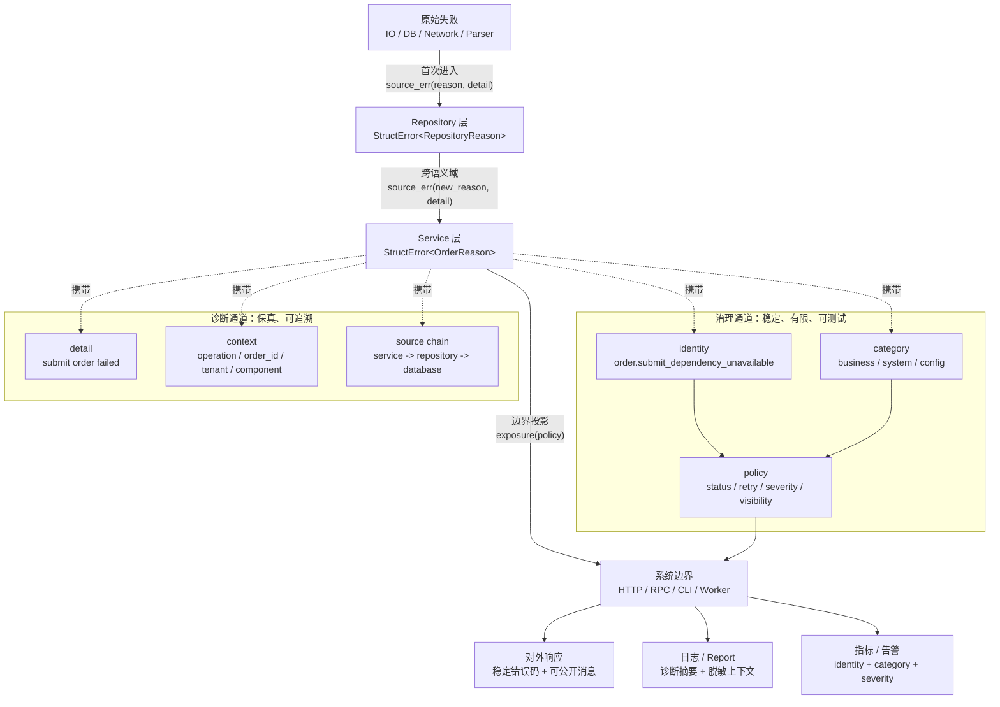
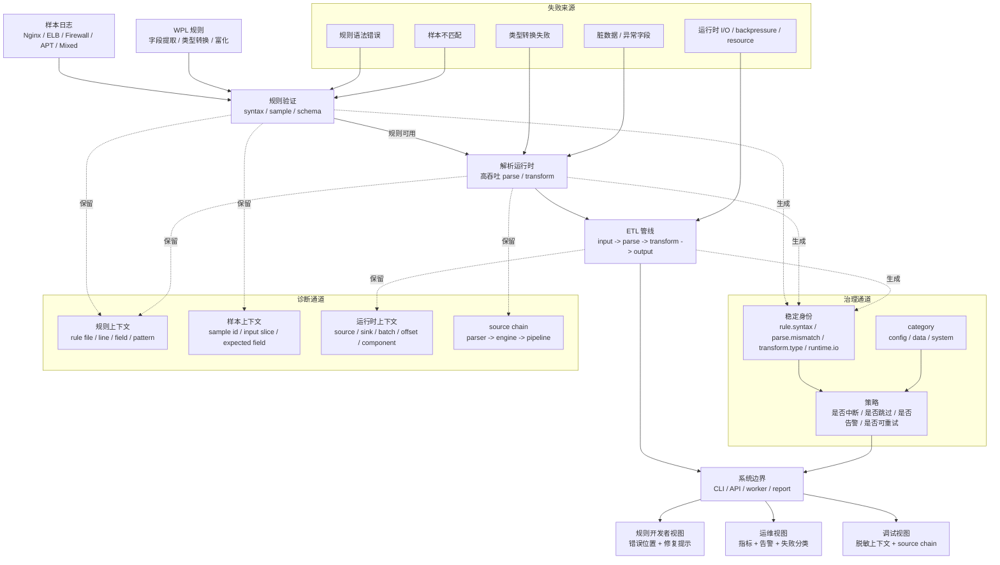

# 双通道：工业级系统的错误治理模型

这篇文章讨论一个问题：工业级系统如何让错误在治理层面收敛、在诊断层面保真。

如果只想快速把握主线，可以先读这四段：

1. [核心矛盾](#核心矛盾)：为什么错误治理的本质是“收敛 vs. 诊断”。
2. [我们的方案：双通道错误治理模型](#我们的方案双通道错误治理模型)：模型如何拆分治理通道和诊断通道。
3. [基于 Rust 的错误治理方案](#基于-rust-的错误治理方案)：如何用 `orion-error` 落地。
4. [工业级应用验证：WarpParse](#工业级应用验证warpparse)：高吞吐 ETL 场景如何验证这套方法。

本文分成三层：

- **方法论层**：错误处理为什么重要、核心矛盾是什么、五项原则如何定义。
- **工程落地层**：Rust 下如何用 `orion-error` 实现稳定身份、诊断链、边界投影和桥接。
- **工业验证层**：WarpParse 和 AI skills 如何把这套模型用于真实工程。

---

## 错误处理是原型与工业级的分水岭

原型只需证明正确路径可以跑通；工业级应用还须在非理想条件下可运行、可诊断、可恢复、可演进。

系统不会长期运行在理想条件下。输入变化，依赖退化，网络抖动，配置漂移，数据积累脏状态，业务规则迭代。处理路径随用户、环境、状态和策略动态分叉。正确路径不是系统运行的全部；失败、降级、重试、回滚、补偿和人工介入同样是生命周期的一部分。

因此，错误不是"正常逻辑之外的意外文本"，而是系统在非理想条件下继续运行、恢复状态、决定对外响应、支持诊断时必须传递的信息。

很多项目在早期把错误处理当作"每个函数自己的事"。每个函数决定如何表达失败，然后这个决策在下一个函数、下一个模块、下一个边界被重新做一次。

这种模式在小型项目中可以工作——调用链短、边界少、参与者对上下文有共同记忆。但当错误信息没有统一形态，且开始跨越团队、子系统、服务边界、协议边界或长期兼容边界时，失败路径就会变得不可治理：

- 同一种失败，A 模块返回字符串，B 模块返回 enum，C 模块直接 panic
- 边界输出时，每一层都在重新拼 JSON，结构却不一致
- 排障时，日志中有散落的消息，却没有一条完整的错误路径
- 重构时，不敢动错误类型——因为不知道哪些上层依赖了错误字符串内容

这些现象不一定来自某个函数"写得不好"。它们也可能来自缺乏统一工具、团队规范缺失、历史演进、人员流动或边界职责不清。关键在于：一旦错误需要在多个边界之间传播、被多个角色消费、并长期保持兼容，错误就不再只是局部控制流。

错误治理定义了失败发生后系统如何保留信息、跨层传递、对外暴露、支撑诊断和演进。它不是业务逻辑的装饰，而是业务逻辑失败时的信息架构。

---

## 行业一直在探索错误处理

错误处理的重要性已得到专业工程师和工业界的共同认可。真正困难的不是"要不要处理错误"，而是如何有效处理：既不能让它吞没业务代码，也不能让失败路径退化成不可治理的字符串；既要让调用方做稳定决策，又要让排障方保留足够细节。

不同语言对错误处理的设计，正说明这个问题长期没有唯一答案。

- C 主要依赖返回码、`errno` 和约定。直接、低成本，但错误信息容易分散，调用方也容易漏检。
- Java 把异常机制作为主路径，区分 checked exception 与 unchecked exception。它强化了错误传播能力，但也带来异常层次膨胀、边界语义不清和过度捕获的问题。
- Go 强调显式返回 `error`，让失败路径可见。但如果缺少团队约束，错误很容易变成层层包装的字符串。
- Rust 通过 `Result<T, E>`、`?`、枚举和类型系统把错误纳入普通控制流，让错误路径显式可组合。但分类、上下文、边界暴露和诊断策略仍需工程层面设计。

这些设计各有取舍。语言机制能降低错误处理成本，却不能替代错误治理本身。大型工程真正需要解决的不是选择异常、返回码还是 `Result`，而是失败信息在系统中如何被分类、保留、转换、暴露和观测。

对研发团队而言，有效完成错误处理横跨类型设计、调用链传播、日志与观测、协议输出、用户体验、运维策略和长期兼容；任一环节各自为政，最终都会在排障、重构和边界协作时暴露成本。错误处理不能只依赖个人经验和局部习惯，而需要一套可讨论、可执行、可演进的方法论。

到今天为止，业界并没有形成跨语言、跨框架、跨业务形态的统一错误治理方案。但一些优秀项目已经在不同方向给出了可参考实践：稳定错误码、结构化诊断、集中边界策略、状态化错误呈现、可观测错误信号、面向用户的修复提示。这些实践说明，错误治理不是单一 API 问题，而是一组围绕失败信息展开的工程约束。

## 来自优秀项目的证据

| 项目 | 做法 | 启发 |
|------|------|------|
| gRPC | 跨语言 RPC 失败收敛为标准状态码 | 稳定分类让调用方可重试、降级、告警和映射用户响应 |
| PostgreSQL | 使用稳定 SQLSTATE 错误码，不依赖错误文本 | 机器契约和人类文案应该分离 |
| Kubernetes | 就绪状态、失败原因和 condition 写入 `status` | 错误可以是可查询、可自动化处理的系统状态 |
| Terraform | diagnostics 含 severity、summary、detail、attribute path | 错误应指出位置、原因和修复方向 |
| rustc | 错误码、源码位置、label、note、help 构成诊断体验 | 诊断信息本身是产品体验 |
| Envoy | access log response flags 表达稳定失败原因 | 边界层错误应能被聚合、搜索、告警和自动分析 |

这些项目形态不同，方向一致：优秀的错误处理都把失败路径设计成稳定的信息系统——既有机器可判断的分类，也有人能理解的诊断；既在内部保留细节，也在边界按策略暴露；既服务当前请求，也服务后续排障、监控和演进。

---

## 核心矛盾

任何错误治理方案都要处理一对根本矛盾：

**收敛 vs. 诊断**

- 调用方需要**稳定的、有限的分类**，否则无法做出治理决策（重试、降级、告警、返回给用户）
- 排障方需要**完整的、保留细节的信息**，否则无法定位根因

这两类需求都合理，但天然拉向不同方向。

如果错误向调用方暴露过多技术细节，上层就会依赖数据库、网络库、文件系统、第三方 SDK 的具体失败形态，系统边界被技术实现穿透。重构底层实现时，错误契约被迫变化。

如果错误只保留上层业务分类，排障时又会失去关键路径：原始失败是什么、发生在哪个组件、经过了哪些层、每层追加了什么上下文、最终为何被映射成这个对外响应。

因此，错误治理的主要矛盾不是"要不要包装错误"，而是：**如何同时让错误在治理层面收敛，在诊断层面保真。**

### 不充分的解决方案

| 策略 | 对调用方 | 对排障方 |
|------|---------|---------|
| 只抛技术异常 | 无法治理 | 信息完整 |
| 只抛业务错误 | 可以治理 | 丢失根因 |
| 纯字符串链式包装 | 无法治理 | 可读但不可结构化查询 |
| 保留类型信息的链式包装 | 可做局部治理 | 保留原因链，但分类与边界策略仍需额外约束 |
| 吞掉错误 | 干净 | 丢失所有信息 |

纯字符串链只是把错误文案一层层拼起来；保留类型信息的链式包装（cause chain、typed wrapping、`errors.Is`/`errors.As`）可支持一定程度的结构化查询，但它只解决"原因如何保留和查询"，不自动解决稳定身份、分类边界、暴露策略和治理动作映射。

这些方案如果只依赖单一形态同时满足两类需求，结果往往是牺牲其中一边：要么调用方信息太散无法自动化治理，要么排障方信息太少只能翻日志和复现。

### 砖块不等于建筑

一个常见质疑：Java 的异常 + 错误码、Go 的 sentinel error + wrapping、Rust 的 enum + cause chain，不是已经覆盖了双通道模型要解决的大部分问题吗？

这些机制都是砖块，但砖块不等于建筑。问题出在三点。

**身份不稳定。** Java 生态中异常类型承担分发角色：`catch (OrderNotFoundException e)`。但异常类型受继承层次控制，重构时会变。错误码是异常的附赠字段，调用方先 `instanceof` 再取 `getErrorCode()`——错误码不是路由主键。双通道模型的主张是：把身份提升为治理通道的第一公民，边界策略基于身份路由，与继承层次解耦。不管用 `enum`、错误码字符串还是 tagged union 表达，身份本身必须是稳定的、可文档化的、被测试约束的契约。

**分类空间天然膨胀。** 异常机制鼓励"一种失败一个类"：`SubmitDependencyUnavailableException`、`InvalidStateException`……类数量跟随业务失败模式无限制增长，没有机制强制收敛到有限分类。如果异常类型同时承担分类职责，分类就不可能稳定——每新增一个 exception class，所有依赖异常层次做路由的边界都可能受影响。双通道模型把分类空间（`R`）限制为有限枚举，新增变体是有意为之的兼容演进，不是随意加类。

**治理和诊断共用同一通道，互相牵制。** cause chain、structured wrapping、`errors.Is`/`errors.As` 解决的是诊断保留——根因如何保留和查询。它们不解决：该触发重试还是降级？该映射到哪个 HTTP 状态码？该暴露给用户还是只记日志？这些治理动作若由异常类型、字段或局部判断来做，就会散落在每个 handler、每个 catch 块、每个 `errors.Is` 调用中。双通道模型把治理信息和诊断信息分离成不同通道，治理动作由集中策略而非局部代码决定。

综上，关键区别不在于你用什么语言机制，而在于你的错误架构有没有这四根承重墙：稳定身份（不受类型重构影响）、有限分类空间（受兼容演进规则约束）、诊断保留（跨层不丢失）、集中边界策略（不在 handler 中重复决策）。失去这些结构，任何语言的错误处理都会长成不可治理的灌木丛——哪怕砖块是顶好的。

### 我们的方案：双通道错误治理模型

核心方法论：**把分类信息和诊断信息分离到两个维度，通过两个通道传递。**

```text
错误 = 稳定身份 + 稳定分类 + 诊断链 + 上下文 + 细节
```

稳定身份和稳定分类服务治理决策（重试、降级、告警、HTTP/RPC/CLI 映射、用户提示、SLA 统计），应有限、稳定、可文档化、可测试。

诊断链、上下文和细节服务问题定位（底层原因、经过的层、当前操作、关键字段、组件、环境），可以更丰富、更动态，但不应成为外部调用方的稳定契约。

| 通道 | 包含什么 | 服务谁 | 稳定性要求 |
|------|---------|--------|------------|
| 治理通道 | 稳定身份、稳定分类、category、retryable、severity、暴露等级 | 调用方、网关、监控、运维策略、协议客户端 | 高，应被文档化和测试约束 |
| 诊断通道 | 原因链、操作上下文、关键字段、动态细节、底层错误 | 开发者、SRE、排障工具、日志系统 | 可动态变化，但须保真且可追溯 |

`category` 是稳定分类的固定治理维度（business / system / config），用于快速区分错误归属域，辅助告警路由、日志聚合和边界策略。`retryable`、`severity`、暴露等级等治理属性，由稳定身份和分类策略派生。

| 组成部分 | 含义 | 例子 |
|----------|------|------|
| 稳定身份 | 机器可判读的错误主键，面向长期兼容 | `order.not_found`、`system.timeout` |
| 稳定分类 | 面向治理决策的有限类别 | 业务错误、配置错误、系统错误、超时、限流 |
| 治理属性 | 从稳定身份和分类派生的辅助决策字段 | category、retryable、severity、暴露等级 |
| 诊断链 | 跨层传播时保留的 cause/source 路径 | service failure -> repository failure -> database timeout |
| 上下文 | 当前操作的结构化环境，回答"在哪、对谁、执行什么" | operation、tenant、path、order_id、component |
| 细节 | 当前层对这次失败的具体解释 | `read config failed`、`upstream returned 503` |

同一个错误通过不同视图同时服务两类需求，减少调用方和排障方互相牺牲。

---

## 方案原则

双通道模型落地需要五项原则配合：统一载体承载结构，治理通道保持稳定，诊断通道跨层保真，边界集中投影，外部生态显式桥接。

本节代码只表达方法论形状，是语言无关的伪代码。

### 原则一：用统一载体承载双通道信息

**自有跨层错误传播路径应使用统一的结构模型。**

反例：

```rust
// A 模块返回 io::Error
fn read_file() -> io::Result<Data>

// B 模块返回自定义 enum
fn validate() -> Result<Data, ValidationError>

// C 模块返回字符串
fn process() -> Result<Data, String>
```

每条错误路径的调用者都需学习一套新形状。组合两个不同函数的错误路径时，调用方既要判断分类，又要重新拼接诊断信息，还要决定边界输出格式。

正例：

```text
read_file() -> Result<Data, StructuredError<ErrorClass>>
validate() -> Result<Data, StructuredError<ErrorClass>>
process() -> Result<Data, StructuredError<ErrorClass>>
```

载体模型统一，才能同时承载稳定分类和诊断信息。变化的是分类空间和上下文。不同层可拥有自己的分类空间，但跨层传播时应有清晰的收敛或边界转换规则。

统一载体不是要求第三方库、标准库、框架异常或协议错误全改成同一种类型；它要求团队控制的内部传播路径使用同一种结构模型，进入或离开外部生态时显式桥接。

### 原则二：让治理通道保持稳定

**错误分类契约应按向后兼容规则演进。**

错误分类体系是契约——调用方依赖它做治理决策。"稳定"不是指不能新增分类，而是已有分类的机器身份和语义不能随意变化。

错误身份是治理通道里的机器主键，通常表现为稳定字符串、错误码或协议字段（如 `business.not_found`、`system.timeout`）。调用方、网关、监控、告警和文档都应依赖这个身份，而非错误消息文本。

分类契约的兼容规则：

- 可以新增错误身份或分类，表达新的业务失败或系统失败。
- 不应删除已对外承诺的错误身份；若必须废弃，应保留兼容映射或经明确的版本迁移。
- 不应改变已有身份的语义（如把 `business.not_found` 从"资源不存在"改成"无权限访问"）。
- 不应让同一身份在不同边界产生矛盾的治理动作（如一处可重试、另一处不可重试）。
- 可以调整错误文案、诊断细节、上下文字段和底层原因链，只要不破坏身份和分类语义。

| 应该稳定的 | 可以变化的 |
|-----------|-----------|
| 稳定错误身份 | 诊断细节 |
| 分类语义 | 错误信息文案 |
| category（业务/系统/配置） | 具体的技术细节 |

稳定分类的另一个好处：它是人和系统之间的共享接口。运维配置告警规则、网关配置状态码映射、API 文档描述错误响应——全部依赖稳定身份和分类语义，而非错误文本。枚举、异常类型、错误码或 tagged union 只是表达这个契约的具体方式。

### 原则三：让诊断通道跨层保真

**错误在内部传播时应追加信息，不应破坏已有诊断链。**

反例：

```text
repository() -> Result<Data, RepoError> {
    // 数据库连接失败，返回 RepositoryConnectionFailed
}

service() -> Result<Data, ServiceError> {
    data = repository()?  // 丢弃了下层错误的具体信息
    return data
}
```

正例：

```text
repository() -> Result<Data, StructuredError<RepositoryClass>> {
    // 数据库连接失败，保留原始数据库错误
}

service() -> Result<Data, StructuredError<ServiceClass>> {
    data = repository()
        .wrap_as_cause(ServiceDependencyFailed, "load repository data failed")
    return data
}
```

每层保留的信息形成完整错误链，排障时从最终错误追溯到原始根因。

这里有两种操作：

- 若当前层只把下层分类收敛到上层分类空间、不建立新语义边界，应保留原有诊断链，不制造新错误叙事。
- 若当前层要表达新的失败语义，应把下层错误作为原因保留，并追加当前层解释。

判断标准是语义域，不是函数层数。

若上下层属同一语义域，错误转换通常只是分类收敛。例如 database driver、query executor、repository helper 同属 data access 语义域；它们之间可将底层连接失败收敛为 `RepositoryConnectionFailed`，同时保留原始数据库错误和上下文，不必每层都追加业务叙事。

若错误跨越了语义域或架构责任边界，就应建立新语义边界。例如 data access 失败进入 order service 时，上层关心的不是"数据库连接失败"，而是"订单草稿加载失败"或"提交订单依赖不可用"。此时应追加 service 层语义，并把下层 data access 错误作为原因保留。

辅助判断问题：

- 当前层是否在向上层隐藏实现细节？
- 当前层是否拥有新的业务含义、用户意图或操作目标？
- 当前层是否会改变治理动作（如从底层 timeout 映射为业务依赖不可用）？
- 若未来替换下层实现，上层错误契约是否应保持不变？

若答案为"是"，这里通常是语义边界；若只是模块拆分、工具函数或同领域内的技术分层，只需分类收敛和诊断保留。边界输出时再按策略做脱敏和投影。

### 原则四：在边界集中投影

**边界暴露策略应集中定义，不在每个边界点重新决定。**

结构化错误在内部传播时携带治理通道和诊断通道；到达边界时，边界层从治理通道取得稳定身份（`error_identity`），交给统一策略决定投影。

```text
StructuredError<ErrorClass>
    -> error_identity
    -> exposure_policy
    -> HTTP / RPC / CLI / log / metric
```

反例：

```text
// handler A
match err {
    NotFound => HttpResponse(404, "not found"),
    Timeout => HttpResponse(503, "try again"),
}

// handler B
match err {
    NotFound => HttpResponse(404, "resource missing"),
    Timeout => HttpResponse(504, "gateway timeout"),
}
```

两个 handler 对同一错误的输出不一致。

正例：

```text
// 策略集中定义
policy.status(error_identity) {
    match error_identity {
        "business.not_found" => 404
        "system.timeout" => 503
        _ => 500
    }
}

// 所有边界点使用同一策略
render_error_response(err, policy)
```

集中策略不只负责 HTTP 状态码，还应覆盖：

- 对外错误码和用户可见消息
- HTTP/RPC/CLI 格式映射
- 日志级别和结构化日志字段
- 是否触发告警或计入 SLA
- 是否建议调用方重试、降级或停止重试
- 诊断信息脱敏和暴露等级
- 指标标签和错误聚合维度

这些决策若散落在每个 handler、worker、controller 中，同一身份就可能在不同边界产生不同表现，破坏治理通道稳定性。

### 原则五：显式桥接外部生态

**进入外部生态（日志系统、标准错误接口、第三方库）应是显式的。**

反例：

```text
// 调用者在不知情的情况下把错误降级为普通字符串
handle(error_as_text)  // 擦除了结构化信息
```

正例：

```text
// 显式选择进入外部生态
plain_error = err.to_plain_error()
log_record = err.to_log_record(redaction_policy)
```

显式桥接确保结构化信息的丢失、脱敏或降级是有意为之而非无意遗漏。每个桥接函数应有清楚的桥接契约：

- 目标消费者是谁：用户、协议客户端、日志系统、监控系统、第三方库，还是标准错误接口。
- 保留什么：稳定身份、分类、原因链摘要、操作上下文、关键字段、retryable、severity。
- 丢弃什么：内部实现类型、敏感字段、过长底层错误、无法稳定解析的动态文本。
- 脱敏什么：token、密钥、用户隐私、租户隔离信息、内部拓扑、SQL 片段或请求载荷。
- 如何降级：当目标生态只能接收字符串或普通异常时，哪些字段压缩进文本，哪些彻底丢失。

不同桥接目标应有不同契约：写日志时保留身份、分类、上下文、关键字段和原因链摘要；对外响应时只暴露错误码、可公开消息和修复提示；进入标准错误接口时可能只保留文本和 source 链。桥接的重点不是"所有信息都带出去"，而是每次投影都可审计、可测试、可预期。

---

## 错误传播的三种模式

错误传播不是机械向上抛。一个工业级错误经历三种动作：首次进入、跨层转换、边界输出。

### 首次进入

原始错误（IO、解析、网络错误）首次进入结构化系统，需同时完成：

1. 选择分类（业务 vs 系统 vs 配置）
2. 给出当前层解释（detail）
3. 保留原始错误作为底层原因

三个诊断概念的分工：`source/cause` 回答根因是什么，`context` 回答在哪、对谁、执行什么，`detail` 回答当前层如何理解这次失败。

### 跨层转换

上层将下层错误分类收敛到自己的分类空间：若只做分类重新映射，保留所有诊断信息；若要建立新语义边界，将下层错误作为原因包裹。取决于当前层是否是新语义边界。

### 边界输出

在系统边界（HTTP handler、RPC 端点、CLI 入口、日志写入点）输出错误：选择输出格式，应用暴露策略，输出。

### 一个完整传播示例

下面是一次"提交订单"失败经过三种模式的完整路径。

第一步，数据库错误首次进入结构化系统。repository 层选择 data access 语义下的稳定分类，保留数据库错误为 source，添加操作上下文。

```text
repository.insert_order(order) -> Result<(), StructuredError<RepositoryClass>> {
    db.insert(order)
        .on_error(source_error) {
            return StructuredError {
                identity: "repository.connection_failed",
                class: RepositoryConnectionFailed,
                detail: "insert order failed",
                context: {
                    operation: "insert_order",
                    order_id: order.id,
                    component: "order_repository"
                },
                source: source_error
            }
        }
}
```

第二步，service 层跨到业务语义域。不把数据库连接失败暴露给上层，而是表达业务失败：提交订单依赖不可用，同时保留下层 repository 错误为 cause。

```text
service.submit_order(order) -> Result<(), StructuredError<ServiceClass>> {
    repository.insert_order(order)
        .on_error(repo_error) {
            return StructuredError {
                identity: "order.submit_dependency_unavailable",
                class: SubmitDependencyUnavailable,
                detail: "submit order failed",
                context: {
                    operation: "submit_order",
                    order_id: order.id,
                    tenant: order.tenant
                },
                source: repo_error
            }
        }
}
```

第三步，HTTP handler 到达边界。不重新解释错误，交给集中策略投影。

```text
handler.post_orders(req) -> HttpResponse {
    result = service.submit_order(req.order)

    if result is error {
        err = result.error
        identity = err.identity

        log_record = policy.to_log_record(err)
        metrics.record(policy.metric_labels(identity))

        return HttpResponse {
            status: policy.http_status(identity),
            body: policy.public_body(identity),
            retry_after: policy.retry_after(identity)
        }
    }
}
```

治理通道最终给边界的是 `order.submit_dependency_unavailable`，用于决定状态码、用户消息、重试建议和指标标签；诊断通道保留了 service detail、repository detail、上下文和原始数据库错误。调用方不需要知道数据库细节，排障方仍可追溯根因。

---

## 治理等级

错误治理成熟度分四个等级：

**L0：无治理**

- 错误类型散乱：`std::io::Error` / `String` / `Box<dyn Error>` / 自定义 enum 混用
- 边界输出拼接字符串
- 排障依赖 grep 日志

**L1：统一载体**

- 自有跨层路径返回同一结构模型
- 但分类随意，同一失败在不同模块归类不一致
- 有原因链，但经常在跨层时被丢弃

**L2：稳定分类**

- 分类契约稳定，有文档定义
- 边界输出使用统一策略
- 原因链跨层完整保留
- 测试断言错误身份，而非错误消息

**L3：治理驱动**

- 错误分类直接映射到治理动作（重试、降级、告警、SLA）
- 边界策略可配置，不同环境可不同
- 错误指标进入监控系统
- 新错误类型需 review 才能加入

大多数团队在 L0 和 L1 之间。L1 到 L2 是最容易被低估的一步：不是把返回类型换成统一载体就结束了，而是要让团队对"哪些失败共享同一身份"、"哪些分类代表可重试"、"哪些错误可对外暴露"形成共同语义。

从 L1 到 L2 需要：

- 标准化分类契约，明确稳定身份、分类语义、category 和治理含义。
- 梳理存量错误，把散落的字符串、技术异常和临时 enum 迁移到稳定分类。
- 建立边界策略，统一 HTTP/RPC/CLI/log/metric 投影规则。
- 建立测试规范，断言错误身份和治理决策，而非断言错误消息。
- 建立评审习惯，新增错误时讨论语义归属，而非只讨论能否编译。

L1 到 L2 不是局部重构，而是团队协作模式的变化：错误分类从个人实现细节变成共享工程语言。

L3 意味着错误治理进入组织流程。新错误类型需要 review，因为每个新稳定身份都可能影响告警、重试、SLA、用户文案、协议兼容和运维看板。到了这个阶段，错误分类变更应像 API 变更一样被管理：有命名规范、兼容性规则、策略映射、测试覆盖，也有废弃和迁移路径。

---

## 不适用场景

1. **小型项目、原型、脚本。** 边界少、生命周期短、错误在局部处理时，没必要引入分层治理。
2. **性能极端敏感的场景。** 结构化错误路径有分配、原因链和上下文采集、序列化等成本；静态类型语言中泛型或模板还可能增加编译时间和代码体积。
3. **错误不需要跨层传播。** 若所有错误都在一层内处理完毕，收益接近于零。

---

## 语言机制与生态采纳

方法论与语言无关，但不同语言落地成本不同。区分两个维度：

- **语言表达能力**：语言是否方便表达稳定分类、结构化载体、原因链和边界投影。
- **生态采纳成本**：团队在既有生态中采用这套治理需要付出的组织和迁移成本。

亲和度高不等于采纳容易。Rust 类型系统非常适合这套模型，但错误生态路径较多；Go 类型表达能力弱，但显式 error 返回高度统一，引入轻量分类规范的组织成本反而可能更低。

### Rust — 原生匹配

Rust 同时满足三项：代数类型（`enum`）表达分类，`match` 提供穷尽检查；泛型提供类型安全的载体参数化；无异常机制，错误通过返回值传递，自然与载体配合。

但 Rust 的实际采纳并不简单。生态中长期存在 `failure`、`error-chain`、`anyhow`、`thiserror`、`eyre` 等不同取向：有的偏快速传播，有的偏诊断报告，有的偏领域错误定义。团队仍需明确边界：哪些层用结构化治理错误，哪些边界允许快速错误聚合，哪些错误身份进入长期契约。

### TypeScript — 亲和度高

```typescript
type AppErrorClass =
  | { kind: "not_found"; id: string }
  | { kind: "system_error" };
```

Union type + discriminated union 天然适合错误分类。`neverthrow`、`fp-ts` 的 `Either` 等库提供了返回值式错误处理。Zod 等 schema 库也能帮助把输入校验错误结构化，分离字段路径、错误码和用户提示。

弱点是运行时类型信息有限，跨进程、跨包、跨 JSON 边界时仍需显式 runtime tag、schema 或协议字段保存错误身份和分类。

### Swift — 亲和度高

代数类型（enum with associated values）表达错误分类。`Result<T, E>` 在 Swift 5.0+ 中原生支持。社区中有用 `Result` 替代 `throws` 的实践。

### C# — 需要映射到异常生态

泛型支持良好（运行时保留类型信息），但异常机制主导生态。缺原生 discriminated union（可用 `OneOf` 模拟）。更自然的映射不是强行改成 Result，而是用异常类型层次表达分类、inner exception 保留原因链、ASP.NET Core 中间件做集中策略。

### Java — 需要映射到框架约定

泛型擦除，异常机制主导。但 cause chain 机制成熟，Spring 的 `@ControllerAdvice`、filter、interceptor 已是集中策略的常见模式。Java 17+ 的 sealed class、record 和 pattern matching 让有限分类表达比过去更自然。更合适的做法是借鉴分类稳定、诊断链、边界集中投影的思想，而非照搬返回值式载体。

**核心映射：每个语义域定义一个 sealed class，域之间无继承关系。**

和 Rust 方案对应——Rust 中每个语义域有自己的 `Reason` 枚举，`RepositoryReason` 和 `OrderReason` 是两个独立的类型，不共享 trait 之外的继承。Java 同理：`RepositoryError` 和 `OrderError` 是两个独立的 sealed class，各自在自己的语义域内约束分类空间。跨域时不是向上转型到共同的父类，而是**构造新域的异常，把旧域异常作为 cause 保留**。

```java
// ===== data access 语义域 =====
public sealed abstract class RepositoryError extends RuntimeException
    permits RepositoryError.ConnectionFailed,
           RepositoryError.WriteFailed,
           RepositoryError.General {

    public abstract String identity();
    public abstract String category();
    public abstract boolean retryable();

    private DiagnoseContext ctx;
    public DiagnoseContext context() { return ctx; }

    protected RepositoryError(String detail, Throwable cause, DiagnoseContext ctx) {
        super(detail, cause);
        this.ctx = ctx;
    }

    public static final class ConnectionFailed extends RepositoryError {
        public ConnectionFailed(String detail, Throwable cause, DiagnoseContext ctx) {
            super(detail, cause, ctx);
        }
        public String identity() { return "repository.connection_failed"; }
        public String category() { return "system"; }
        public boolean retryable() { return true; }
    }
    // WriteFailed, General ...
}

// ===== order 业务语义域 =====
public sealed abstract class OrderError extends RuntimeException
    permits OrderError.DependencyUnavailable,
           OrderError.InvalidState,
           OrderError.General {

    public abstract String identity();
    public abstract String category();
    public abstract boolean retryable();

    private DiagnoseContext ctx;
    public DiagnoseContext context() { return ctx; }

    protected OrderError(String detail, Throwable cause, DiagnoseContext ctx) {
        super(detail, cause);
        this.ctx = ctx;
    }

    public static final class DependencyUnavailable extends OrderError {
        public DependencyUnavailable(String detail, Throwable cause, DiagnoseContext ctx) {
            super(detail, cause, ctx);
        }
        public String identity() { return "order.submit_dependency_unavailable"; }
        public String category() { return "system"; }
        public boolean retryable() { return true; }
    }
    // InvalidState, General ...
}
```

`DiagnoseContext` 是跨域通用的 record，不绑定特定语义域：

```java
public record DiagnoseContext(
    String operation,
    String entityId,
    String tenant,
    String component
) {}
```

**完整的传播路径：三层，两个语义域。**

第一步，数据库错误在 Repository 层首次进入结构化体系：

```java
// Repository 层：首次进入
var ctx = new DiagnoseContext("insert_order", order.id, null, "order_repository");
try {
    db.insert(order);
} catch (SQLException e) {
    throw new RepositoryError.ConnectionFailed("insert order failed", e, ctx);
}
```

第二步，Service 层跨越语义域。这里的关键动作不是向上转型，而是**构造新域的异常**：`RepositoryError` 不继承 `OrderError`，两者是平级的独立类型，通过 cause chain 连接。

```java
// Service 层：跨语义域——构造 OrderError，把 RepositoryError 作为 cause
var ctx = new DiagnoseContext("submit_order", order.id, order.tenant, "order_service");
try {
    repository.insert(order);
} catch (RepositoryError e) {
    throw new OrderError.DependencyUnavailable("submit order failed", e, ctx);
    //                                              detail ─────────┘  ↑   ↑
    //                                              cause ────────────┘   │
    //                                              context ──────────────┘
}
```

此时 cause chain 为：
```text
OrderError.DependencyUnavailable
  └─ cause: RepositoryError.ConnectionFailed
       └─ cause: SQLException ("Connection reset")
```

第三步，边界层交给 `@ControllerAdvice` 统一投影。`@ExceptionHandler` 按域注册：`OrderError` 的 handler 处理所有业务语义域的错误，`RepositoryError` 如果没有被上层转换则在边界作为 500 兜底。

```java
@ControllerAdvice
public class ErrorPolicy {
    @ExceptionHandler(OrderError.class)
    public ResponseEntity<ErrorBody> handleOrder(OrderError e) {
        logger.error(e.toLogRecord());              // 诊断通道：完整 cause chain + context
        return ResponseEntity
            .status(statusOf(e.identity()))          // 治理通道：基于身份路由
            .body(new ErrorBody(e.identity(), publicMessageOf(e.identity())));
    }

    @ExceptionHandler(RepositoryError.class)
    public ResponseEntity<ErrorBody> handleRepo(RepositoryError e) {
        // 未被上层转换的 repository 错误 = 内部错误兜底
        logger.error(e.toLogRecord());
        return ResponseEntity.status(500)
            .body(new ErrorBody("internal_error", "internal error"));
    }
}
```

**和 Rust 方案的对比。** 两者的结构一一对应：

| 概念 | Rust | Java |
|------|------|------|
| 语义域分类 | `enum RepositoryReason` | `sealed class RepositoryError` |
| 治理通道 | reason 枚举变体 + identity 字符串 | 子类覆写的 `identity()` / `category()` / `retryable()` |
| 诊断通道 | `StructError` 的 detail / context / source 字段 | `getMessage()` / `context()` record / `getCause()` |
| 统一载体 | `StructError<R>` 泛型参数化 | **不可行** —— JLS 禁止泛型类继承 Throwable |
| 跨域转换 | `source_err(OrderReason::..., detail)` —— 一行 | `catch (RepositoryError e) { throw new OrderError(..., e, ctx) }` —— 四行 |

Java 无法像 Rust 那样用一个 `StructuredError<R>` 泛型类统一所有域的载体——Java 语言规范明确禁止泛型类继承 `Throwable`（`class StructError<R> extends RuntimeException` 是编译错误）。即使绕过 Throwable 改用返回值式载体，又会丢失 `@ControllerAdvice`、cause chain、堆栈追踪等异常生态基础设施。因此 Java 方案只能用独立 sealed class 作为每个域的载体——这是类型系统的硬约束，不是设计偏好。

Java 方案的额外代价：跨域转换必须显式 try-catch，无法像 Rust 的 `?` + `source_err` 那样一行完成。这不是设计问题，是异常机制的固有代价——异常通过抛出/捕获传递，不存在 `map_err` 式的链式转换。

**测试。** 和 Rust 版本同理，断言身份而非消息：

```java
@Test
void shouldFailWithDependencyUnavailableWhenRepoFails() {
    OrderError err = assertThrows(OrderError.class,
        () -> service.submit(order));
    assertEquals("order.submit_dependency_unavailable", err.identity());
    assertTrue(err.retryable());
    // 诊断链完整
    assertNotNull(err.getCause());                   // RepositoryError
    assertNotNull(err.getCause().getCause());         // SQLException
}
```

这个方案的关键不是异常 vs. Result 的选择。关键是：每个语义域的 sealed class 是独立类型（不共享业务继承层次），跨域通过构造新异常 + cause 保留完成，稳定身份是字段主键而非类的副产品，边界策略集中路由，测试断言身份和诊断存在性。这几根承重墙和 Rust 方案完全一致。Java 的附加代价是跨域 try-catch 的代码量和编译器不强制 context 存在——两项都需团队纪律补足。

### C++ — 技术可行，生态无约定

模板保留类型信息，`std::expected`（C++23）提供类似 `Result` 的机制，Boost.Outcome 等库也提供了更完整的结果/错误建模。但 C++ 错误处理长期并存异常、错误码、expected、Outcome、自定义 status 等多条路径，生态无主导载体。技术可行，组织统一成本高。

### Go — 需要更多团队约束

`error` 接口默认只要求 `Error() string`，结构化信息需通过自定义 error 类型、`errors.Is`/`errors.As` 和 wrapping 额外建立。Go 不是不能做错误治理，而是生态默认路径偏轻量包装，治理约束需团队主动设计。

### 两个维度的对比

| 语言 | 语言表达能力 | 生态采纳成本 | 主要原因 |
|------|--------------|--------------|----------|
| Rust | 高 | 中 | 类型系统匹配，但错误生态路径较多，需团队约定边界 |
| Swift | 高 | 中 | enum/Result 表达自然，但 `throws` 仍是重要生态路径 |
| TypeScript | 中高 | 中 | discriminated union 方便，但运行时需 schema/tag 补足 |
| C# | 中 | 中 | 泛型和中间件成熟，但异常生态主导，DU 需模拟 |
| Java | 中 | 中 | cause chain 和框架边界成熟，sealed class 改善分类表达 |
| C++ | 中高 | 高 | 类型能力强，但错误处理路径分裂，组织统一成本高 |
| Go | 低中 | 中低 | 类型表达较弱，但显式 `error` 返回高度统一，轻量分类规范易推广 |

这个表只描述落地摩擦，不评价语言优劣。真正决定错误治理质量的，往往不是语言本身，而是团队是否建立了稳定身份、诊断保留、边界策略和演进规则。

---

## 阶段性小结

以上完成了通用方法论：错误治理为什么重要、核心矛盾是什么、双通道模型如何组织失败信息。接下来进入 Rust 落地。

---

## 基于 Rust 的错误治理方案

Rust 适合做结构化错误治理，但 Rust 不会自动完成治理。`Result<T, E>`、`enum`、`?` 和 trait 解决的是错误表达与传播的语法；稳定身份、语义边界、诊断链保留、边界投影和桥接契约，仍需工程层面设计。

`orion-error` 把双通道模型落成 Rust 基础设施：

```text
Result<T, StructError<R>>

R                 -> 治理通道的 reason / identity / category
StructError<R>    -> 运行时载体，承载 detail / context / source chain
ExposurePolicy    -> 边界投影策略
report / interop  -> 诊断与外部生态桥接
```

`R` 是当前语义域的错误分类契约。不同 bounded context、架构层或业务域可拥有自己的 `Reason` 类型，跨域传播通过显式转换表达语义边界。

下图展示一个错误从底层失败进入结构化体系、跨语义域传播、最终在边界投影的过程。抓住三点：

- 内部传播使用统一载体 `StructError<R>`。
- 同一错误同时携带治理通道和诊断通道。
- 边界层只做策略投影，不重新解释错误。



图中的关键点是：错误在内部传播时不被压扁成字符串；边界层根据策略投影出用户响应、日志/report 和指标/告警三个视图。

### 五项原则的实现映射

| 方法论原则 | Rust / orion-error 落地方式 | 作用 |
|------------|----------------------------|------|
| 用统一载体承载双通道信息 | 内部跨层传播统一使用 `Result<T, StructError<R>>` | 调用方面对同一种错误形状，分类空间由 `R` 参数化 |
| 让治理通道保持稳定 | 领域 reason 定义稳定 identity、category 和分类语义 | 调用方、监控、协议边界依赖身份，不依赖错误文案 |
| 让诊断通道跨层保真 | 使用 detail、context、source chain 保留底层原因与当前层解释 | 上层可以收敛分类，排障仍能追溯根因 |
| 在边界集中投影 | 通过 exposure policy 统一决定 HTTP/RPC/CLI/log/metric 输出 | 避免每个 handler 各自拼响应、各自决定脱敏 |
| 显式桥接外部生态 | report、redacted render、std error interop、protocol JSON 等路径显式转换 | 每次信息降级、脱敏、暴露都有清楚契约 |

### 设计规则一：按语义域定义 Reason

每个语义域定义自己的 reason 类型，而不是把全系统错误塞进一个巨大的全局 enum。

```rust
#[derive(Debug, Clone, OrionError)]
enum RepositoryReason {
    #[orion_error(identity = "repository.connection_failed")]
    ConnectionFailed,

    #[orion_error(identity = "repository.write_failed")]
    WriteFailed,

    #[orion_error(transparent)]
    General(UnifiedReason),
}

#[derive(Debug, Clone, OrionError)]
enum OrderReason {
    #[orion_error(identity = "order.submit_dependency_unavailable")]
    SubmitDependencyUnavailable,

    #[orion_error(identity = "order.invalid_state")]
    InvalidState,

    #[orion_error(transparent)]
    General(UnifiedReason),
}
```

对应前文的稳定分类契约：`repository.connection_failed` 是 data access 语义，`order.submit_dependency_unavailable` 是业务语义。两者可由同一底层失败触发，但不应混成同一分类。

### 设计规则二：首次进入时建立结构化错误

普通 IO、数据库、网络、解析错误首次进入治理体系时，需同时完成：选择当前层分类、给出 detail、保留底层 source。

```rust
fn insert_order(order: &Order) -> Result<(), StructError<RepositoryReason>> {
    let ctx = OperationContext::doing("insert_order")
        .with_field("order_id", order.id.to_string())
        .with_meta("component.name", "order_repository");

    db_insert(order)
        .source_err(RepositoryReason::ConnectionFailed, "insert order failed")
        .map_err(|err| err.with_context(ctx))?;

    Ok(())
}
```

不把底层错误转成字符串。底层错误是 source，`"insert order failed"` 是 repository 层 detail，`order_id` 和 `component.name` 是 context。

### 设计规则三：跨语义域时建立新边界

同一语义域内的分类收敛只做 reason 转换，不新增错误叙事。跨越到新业务语义域时，建立新语义边界，把下层结构化错误作为 source 保留。

```rust
fn submit_order(order: &Order) -> Result<(), StructError<OrderReason>> {
    let ctx = OperationContext::doing("submit_order")
        .with_field("order_id", order.id.to_string())
        .with_field("tenant", order.tenant.to_string());

    insert_order(order)
        .source_err(
            OrderReason::SubmitDependencyUnavailable,
            "submit order failed",
        )
        .map_err(|err| err.with_context(ctx))?;

    Ok(())
}
```

service 层不把 repository 的连接失败暴露给 handler，而是表达业务失败：提交订单依赖不可用。repository 错误仍在 source chain 中。

### 设计规则四：边界只做投影，不重新解释错误

HTTP handler、RPC 端点、CLI 入口和 worker 边界不应重新拼装错误语义，应把结构化错误交给集中策略统一生成响应、日志、指标和调试报告。

```rust
fn handle_submit(req: Request) -> HttpResponse {
    match submit_order(&req.order) {
        Ok(()) => HttpResponse::ok(),
        Err(err) => {
            let snapshot = err.exposure(&DefaultExposurePolicy);
            log_error(err.report());
            HttpResponse::from(snapshot)
        }
    }
}
```

边界有多个视图：对用户 redacted exposure，对开发者和 SRE 保留 report，对监控输出稳定 identity 和 category。

### 设计规则五：测试错误身份，而不是错误文案

进入 L2 后，测试约束稳定身份和治理决策，不约束错误消息。错误消息可优化、翻译、脱敏；身份和分类语义才是长期契约。

```rust
let err = submit_order(&order).unwrap_err();

assert_eq!(
    err.identity_snapshot().code,
    "order.submit_dependency_unavailable"
);

let exposed = err.exposure(&DefaultExposurePolicy);
assert_eq!(exposed.decision.http_status, 503);
```

这类测试倒逼团队维护稳定分类契约：新增错误要有身份，修改身份要考虑兼容，边界策略要有明确预期。

可运行完整示例参见 `orion-error/examples/order_case.rs`：解析层、用户层、存储层和订单服务层各自定义 reason，底层错误首次进入结构化体系，跨层传播通过 reason 收敛保留诊断链，最终在边界统一输出。对应本文的统一载体、稳定分类、跨层保留和边界投影四个核心动作。

---

## 工业级应用验证：WarpParse

`orion-error` 是双通道模型在 Rust 下的基础设施实现。基础设施还需要真实工业级系统验证：高吞吐、长链路、多角色、多边界、强观测要求的系统，才真正检验错误治理是否可用。

WarpParse 是 Orion 体系中面向高吞吐日志解析与 ETL 的核心引擎。根据 `wp-examples/benchmark/report/report_linux.md` 的 Linux 单机 benchmark，WarpParse 0.12.0 在 Nginx、AWS ELB、Firewall、APT Threat、Mixed Log 五类日志及 File -> BlackHole、TCP -> BlackHole、TCP -> File 三种拓扑下，对比 Vector-VRL 0.49.0 取得纯解析 1.56x-20.30x、解析+转换 1.34x-17.90x 的 EPS 倍数区间。

Benchmark 证明的是工业强度：高吞吐、多格式、多拓扑、解析与转换并存。它本身不证明错误治理质量。错误治理的价值，需从失败路径能否被定位、分类、投影和自动化处理来判断。

在这类系统中，若规则语法错误只返回一段字符串：

```text
unexpected token at line 12
```

规则开发者仍需打开规则文件、定位行列、猜测出错字段、判断是语法问题还是样本不匹配。系统也难以基于文本稳定区分"配置错误"、"数据质量问题"和"运行时系统错误"。

引入双通道错误治理后，同一次失败被表达为结构化信息：

```text
identity : rule.syntax
category : config
detail   : unexpected token in extractor expression
context  : {
  rule_file      : "rules/nginx.wpl",
  line           : 12,
  column         : 18,
  field          : "request_time",
  expected_token : "identifier",
  actual_token   : ")"
}
policy   : block rule activation, show repair hint, do not page SRE
```

这是方法论在 WarpParse 中被验证的关键：规则开发者拿到错误位置和修复线索；运行系统拿到稳定身份和治理策略；运维侧可把配置错误、数据错误、系统错误分开统计和告警。吞吐越高，失败路径越需要结构化能力，否则处理能力越强，错误扩散和排障成本也被同步放大。

### WarpParse 的错误治理结构

WarpParse 的错误处理覆盖规则开发、规则验证、运行时解析、管线执行、边界输出和运维观测的完整链路。下图按三层阅读：失败来源、双通道承载、边界视图。



这张图表达的核心原则：WarpParse 的高性能解析和错误治理必须同时存在。`orion-error` 提供错误治理基础设施，WarpParse 验证了这套方法论在工业级高吞吐 ETL 系统中的可用性。

---

## 面向 AI 的工程化复用

双通道模型不应只停留在文档里。更有效的做法是把方法论、设计原则、crate/lib 使用规范、示例代码、反模式和迁移规则整理成可复用的 engineering skills。Orion 体系中的 skills 沉淀在 `orion-skills` 仓库：https://github.com/galaxio-labs/orion-skills

AI 可基于这些 skills 产出项目级错误设计文档。例如 Warp Insight 的错误处理系统设计文档：https://github.com/wp-labs/warp-insight/blob/main/doc/design/foundation/error-handling-system.md 。这类文档的价值不只是记录错误类型，而是让 AI 和工程师围绕同一套治理模型讨论分类、传播、边界输出、观测和迁移。

这样 AI 不再只是临时生成几段错误处理代码，而是围绕一套明确的治理模型工作。面对新项目时，AI 先识别错误边界、语义域、稳定身份、诊断链和边界输出，再给出治理规划；进入实现阶段时，按约定使用 `orion-error`，把 reason 定义、source 保留、context 挂载、exposure 策略和测试断言落到代码里。

skills 把错误治理从"靠经验提示 AI"变成"给 AI 一套工程约束"：

- 规划阶段：识别 L0/L1/L2 现状，设计分类契约和迁移路径。
- 设计阶段：划分语义域，定义 reason、identity、category 和治理属性。
- 实现阶段：选择首次进入、跨层收敛、语义边界包装和边界投影的正确 API。
- Review 阶段：检查是否丢失 source、是否依赖错误文案、是否在 handler 中重复拼响应、是否缺少身份测试。
- 迁移阶段：把字符串错误、临时 enum、泛化包装逐步收敛为稳定的双通道结构。

错误处理横跨架构、协议、观测、测试和团队规范，单靠一次 prompt 难以稳定完成。把方法论和库约束沉淀为 skills 后，AI 才能在不同项目中复用同一套工程判断，生成一致、可维护的实现代码。

---

## 总结

错误处理是系统从原型走向工业级应用的分水岭。原型只需证明正确路径能跑通；工业级系统须在输入变化、依赖退化、配置漂移、数据异常、规则演进和运行环境波动下继续保持可运行、可诊断、可恢复、可演进。

本文提出的 **双通道错误治理模型** 把错误信息拆成两条通道：

- **治理通道**：稳定身份、稳定分类、category、retryable、severity、暴露等级，用于调用方决策、协议投影、监控告警、SLA 统计和长期兼容。
- **诊断通道**：原因链、上下文、细节、底层错误，用于排障、调试、规则修复、运行观测和系统演进。

两条通道解决的核心矛盾：错误在治理层面必须收敛，否则无法自动化决策；在诊断层面必须保真，否则无法定位根因。成熟的错误体系不能只追求"包装得漂亮"，也不能只依赖语言机制，而要明确稳定身份如何演进、诊断链如何跨层保留、边界策略如何集中投影、外部生态桥接时保留和丢弃什么。

在 Rust 中，`orion-error` 将这套模型落成可复用基础设施：`StructError<R>` 承载双通道信息，领域 reason 提供稳定分类契约，source chain 和 context 保留诊断路径，exposure/report/interop 完成不同边界的投影和桥接。`orion-error/examples/order_case.rs` 给出了小型可运行例子，WarpParse 提供了工业级验证：在高吞吐 ETL 系统中，错误治理直接影响规则开发体验、运行时可观测性、边界输出质量和长期运维成本。

错误治理不是异常语法的附属品，也不是日志格式的局部优化。它是工业级系统的信息架构之一。只有当失败路径也具备稳定分类、完整诊断、集中投影和可演进契约时，系统才真正从"能跑"走向"可长期运行"。
